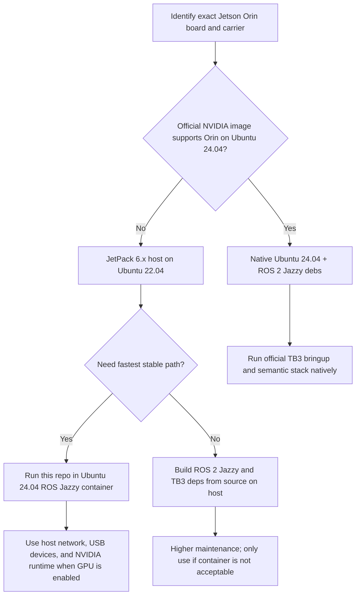
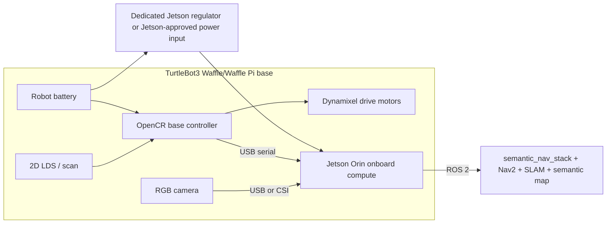

# Jetson Orin TurtleBot3 Waffle Setup Guide

This guide covers mounting a Jetson Orin-class computer on a TurtleBot3 Waffle
or Waffle Pi-class base and preparing it to run the semantic navigation stack in
this repo.

The goal is sim2real continuity: the real robot should use the same ROS graph,
message contracts, semantic map pipeline, query path, Nav2 integration, and
safety gates that were validated in simulation. The only real-robot-specific
parts should be hardware bringup, calibration, topic names, transforms, and
performance tuning.

## Compatibility Decision

As of 2026-04-24, do not assume a native Ubuntu 24.04 Jetson Orin image is
available for the exact Orin board.

The current repo target is ROS 2 Jazzy. Official ROS 2 Jazzy deb packages target
Ubuntu 24.04 on arm64. Current NVIDIA Orin production support is JetPack 6.x /
Jetson Linux 36.x, which uses an Ubuntu 22.04-based root filesystem. NVIDIA's
Jetson Linux 38.4 / JetPack 7.1 stack is Ubuntu 24.04-based, but the current
NVIDIA docs state that this release does not support the Jetson Orin product
family and points Orin users back to Jetson Linux 36.4.4.

Use this decision tree:



Recommended path today for an Orin robot is:

1. Install the NVIDIA-supported JetPack 6.x image for the exact Orin board.
2. Keep the host OS stable and vendor-supported.
3. Run the repo's Jazzy workspace in an Ubuntu 24.04 container with host
   networking and explicit device passthrough.
4. Start perception on CPU first, then move YOLO/refiner workloads onto Jetson
   GPU only after the camera, TF, navigation, and safety gates are validated.

If NVIDIA releases an official Orin Ubuntu 24.04 JetPack before robot bringup,
prefer native Ubuntu 24.04 + ROS 2 Jazzy and skip the container layer.

## Hardware Architecture

The Jetson is the onboard ROS computer. The OpenCR remains the low-level base
controller for motors, wheel odometry, IMU-related base data if present, and the
TurtleBot3 LDS path. The camera feeds the Jetson directly. The semantic stack
uses the same real robot launch path already prepared in this repo.



Important hardware rule: do not power the Jetson from the OpenCR Raspberry
Pi/SBC 5V rail unless the carrier board vendor explicitly supports the exact
load and you have verified current, thermal, and voltage-drop margins. Use a
dedicated regulator or the official Jetson power input for the exact board.

## Required Parts

- TurtleBot3 Waffle or Waffle Pi-class base with OpenCR, LDS, motors, and
  battery in working order.
- Jetson Orin Nano, Orin NX, AGX Orin developer kit, or production module on a
  suitable carrier.
- Mechanical mount plate, standoffs, vibration-safe fasteners, and cable strain
  relief.
- Dedicated Jetson power path:
  - Use the official power adapter for bench setup.
  - Use a robot-mounted DC/DC regulator for mobile setup.
  - Match voltage and current to the exact Jetson carrier board.
  - Add a fuse and accessible power switch.
- USB cable from Jetson to OpenCR.
- RGB camera connected to Jetson by USB or CSI.
- Network path for SSH, preferably Wi-Fi plus a known fallback Ethernet method.
- Optional but recommended: NVMe storage for logs, maps, model weights, and
  COLMAP/refiner jobs.

## Mechanical Mounting

1. Mount the Jetson high enough to keep airflow unobstructed.
2. Keep the heat sink and fan clear of plates, wires, and the robot shell.
3. Keep the Jetson center of mass close to the TurtleBot3 centerline.
4. Use standoffs instead of zip-tying the Jetson directly to a plate.
5. Add strain relief for USB, camera, power, and Ethernet cables.
6. Route motor and battery cables away from camera and USB wiring where possible.
7. Confirm the robot can rotate without cables contacting wheels, LDS, or the
   floor.

Do not permanently mount the Jetson until the bench power test passes.

## Power Bringup

Bench setup first:

1. Power the Jetson from its official adapter.
2. Power the TurtleBot3 normally through OpenCR.
3. Connect Jetson to OpenCR by USB.
4. Confirm the Jetson can run for 20 minutes without throttling or undervoltage.
5. Confirm OpenCR remains visible after repeated reboots:

```bash
ls -l /dev/ttyACM*
dmesg --follow
```

Mobile power setup:

1. Select a regulator that accepts the TurtleBot3 battery voltage range.
2. Set the regulator output to the exact voltage required by the Jetson carrier.
3. Verify output voltage with a multimeter before connecting the Jetson.
4. Add a fuse between battery and regulator.
5. Share ground only as required by the power and USB design.
6. Boot the Jetson, run `tegrastats`, and watch for throttling or brownouts.

```bash
sudo tegrastats
```

If the Jetson reboots when motors start, fix power before running ROS.

## Flash Jetson OS

Record the exact board and carrier before flashing:

```bash
cat /proc/device-tree/model
cat /etc/nv_tegra_release || true
uname -a
```

For current Orin support, flash the latest NVIDIA-supported JetPack 6.x image
for the exact board:

- Orin Nano developer kit: use NVIDIA's Orin Nano JetPack installation path.
- AGX Orin developer kit: use NVIDIA SDK Manager or the Jetson Linux flashing
  tools.
- Production Orin module on a third-party carrier: follow the carrier vendor's
  BSP instructions first, then NVIDIA's Jetson Linux guidance.

After first boot:

```bash
sudo apt update
sudo apt install -y nvidia-jetpack
sudo reboot
```

Then capture versions:

```bash
cat /etc/os-release
cat /etc/nv_tegra_release
dpkg-query -W nvidia-jetpack || true
```

Set hostname and SSH:

```bash
sudo hostnamectl set-hostname tb3-orin
sudo apt install -y openssh-server tmux git curl htop
sudo systemctl enable --now ssh
ip addr
```

## ROS Runtime Path

### Native Ubuntu 24.04 Path

Use this only if the exact Jetson Orin board has an official Ubuntu 24.04-based
NVIDIA image.

Install ROS 2 Jazzy:

```bash
sudo apt update
sudo apt install -y software-properties-common curl
sudo add-apt-repository universe
sudo apt update
sudo apt install -y ros-dev-tools
sudo apt install -y ros-jazzy-ros-base ros-jazzy-navigation2 ros-jazzy-nav2-bringup
sudo apt install -y ros-jazzy-slam-toolbox ros-jazzy-tf2-ros ros-jazzy-vision-msgs
sudo apt install -y ros-jazzy-cv-bridge ros-jazzy-image-transport
```

Install TurtleBot3 dependencies:

```bash
sudo apt install -y ros-jazzy-turtlebot3 ros-jazzy-turtlebot3-bringup
sudo apt install -y ros-jazzy-turtlebot3-msgs ros-jazzy-turtlebot3-navigation2
```

### JetPack 6 Container Path

Use this when the Jetson host is Ubuntu 22.04 from JetPack 6.x.

Install Docker and NVIDIA runtime packages from the JetPack package set. Then
run the repo in a container with:

- `--network host` so ROS discovery works normally.
- USB device access for OpenCR and cameras.
- A mounted workspace from the host.
- NVIDIA runtime only after GPU inference is being tested.

Minimal CPU-first container shape:

```bash
docker run --rm -it \
  --network host \
  --ipc host \
  --privileged \
  -v /dev:/dev \
  -v ~/semantic-nav:/work/semantic-nav \
  -w /work/semantic-nav/dev/turtlebot3/ros2_ws \
  ubuntu:24.04 \
  bash
```

Inside the container, install ROS 2 Jazzy and the same ROS/TurtleBot3 packages
listed in the native path.

GPU inference should be enabled only after CPU-first validation works. For GPU,
use an NVIDIA/Jetson-compatible container base or install JetPack-compatible
PyTorch in the container. Do not assume generic x86 CUDA/PyTorch wheels work on
Jetson arm64.

### Source Build Path

Use only if native 24.04 and containers are not viable. ROS 2 Jazzy can be built
from source on Ubuntu 22.04 as a lower-tier path, but this increases build time,
dependency maintenance, and debugging surface. This is not the preferred
sim2real path for this repo.

## Shell Environment

Set consistent robot environment on the Jetson user account and inside the
container if using one:

```bash
echo 'source /opt/ros/jazzy/setup.bash' >> ~/.bashrc
echo 'export TURTLEBOT3_MODEL=waffle_pi' >> ~/.bashrc
echo 'export ROS_DOMAIN_ID=30' >> ~/.bashrc
echo 'export RMW_IMPLEMENTATION=rmw_fastrtps_cpp' >> ~/.bashrc
source ~/.bashrc
```

Use `waffle_pi` for the current repo defaults. If the physical robot is a
Waffle variant with a different official URDF or camera geometry, update the
launch parameters and TF calibration before arming motion.

## OpenCR And Base Bringup

Follow ROBOTIS' OpenCR setup for the robot model. For Jetson specifically, note
that ROBOTIS documents that the OpenCR Arduino board manager does not support
ARM SBCs such as Raspberry Pi or NVIDIA Jetson. If OpenCR firmware must be
flashed by Arduino IDE, use a separate PC as ROBOTIS documents.

On the Jetson runtime:

```bash
sudo usermod -aG dialout "$USER"
sudo reboot
```

After reboot:

```bash
ls -l /dev/ttyACM*
source /opt/ros/jazzy/setup.bash
export TURTLEBOT3_MODEL=waffle_pi
ros2 launch turtlebot3_bringup robot.launch.py
```

Validate base topics:

```bash
ros2 topic list
ros2 topic echo /scan --once
ros2 topic echo /odom --once
ros2 topic echo /joint_states --once
ros2 run tf2_ros tf2_echo odom base_link
```

Do not start semantic navigation until this passes.

## Camera Setup

The semantic stack needs an RGB image and camera calibration:

- Image topic: `/camera/image_raw`
- Camera info topic: `/camera/camera_info`
- TF chain: `base_link -> <camera frame>`

For a USB camera, use a ROS 2 camera driver that publishes both image and
camera info. For a CSI camera, use the Jetson camera stack or a ROS wrapper that
publishes standard ROS image topics.

Validate:

```bash
ros2 topic hz /camera/image_raw
ros2 topic echo /camera/camera_info --once
ros2 run tf2_ros tf2_echo base_link camera_link
```

Camera calibration and transform are mandatory for real semantic navigation.
Measure the camera pose relative to `base_link` and encode it through the robot
URDF or a static transform publisher. Do not reuse simulation camera transforms
unless the real mount actually matches them.

## Repo Setup On The Robot

Clone this repo:

```bash
cd ~
git clone <semantic-nav-repo-url> semantic-nav
cd ~/semantic-nav
```

The optional semantic memory worker source is vendored in the main repo at:

```text
dev/turtlebot3/external/semantic-nav-memory
```

Do not create a second `semantic-nav-memory` checkout on the robot unless you
are intentionally testing a local worker override. The refiner will prefer the
vendored path and fall back to a root-level checkout only for developer use.

Build the ROS workspace:

```bash
cd ~/semantic-nav/dev/turtlebot3/ros2_ws
source /opt/ros/jazzy/setup.bash
rosdep update
rosdep install --from-paths src --ignore-src -r -y
colcon build --symlink-install
source install/setup.bash
```

If optional dependencies such as COLMAP, PyTorch, Ultralytics, or pycolmap are
not installed yet, keep the refiner disabled for the first real robot run.

## First Real Robot Launch

Terminal 1: base bringup.

```bash
export TURTLEBOT3_MODEL=waffle_pi
source /opt/ros/jazzy/setup.bash
ros2 launch turtlebot3_bringup robot.launch.py
```

Terminal 2: semantic stack, CPU-first and refiner-off.

```bash
cd ~/semantic-nav/dev/turtlebot3/ros2_ws
source /opt/ros/jazzy/setup.bash
source install/setup.bash
ros2 launch tb3_coordinator real_semantic_nav.launch.py \
  detector_device:=cpu \
  refiner_worker_enabled:=false
```

Terminal 3: preflight.

```bash
cd ~/semantic-nav/dev/turtlebot3/ros2_ws
source /opt/ros/jazzy/setup.bash
source install/setup.bash
ros2 run tb3_coordinator real_robot_preflight
```

Expected result:

- `/scan` is fresh.
- `/odom` is fresh.
- `/camera/image_raw` is fresh.
- `/camera/camera_info` is fresh.
- `odom -> base_link` TF exists.
- `base_link -> camera frame` TF exists.
- The coordinator reports `armed=False`.

## Safety Procedure

The real launch starts unarmed. Keep it that way until the robot passes
preflight with wheels off the ground or in a physically bounded area.

Arm:

```bash
ros2 service call /coordinator_node/set_motion_armed std_srvs/srv/SetBool "{data: true}"
```

Disarm:

```bash
ros2 service call /coordinator_node/set_motion_armed std_srvs/srv/SetBool "{data: false}"
```

Rules for first motion:

1. Lift wheels or restrain the robot for the first `/cmd_vel` test.
2. Confirm `/cmd_vel` is idle before arming.
3. Arm for a short interval only.
4. Disarm and verify all coordinator-owned motion stops.
5. Only then test bounded-floor frontier exploration.
6. Only after frontier movement is stable, test semantic query goals.

## Optional GPU Perception

Only switch to GPU after CPU perception works:

```bash
python3 - <<'PY'
import torch
print(torch.__version__)
print(torch.cuda.is_available())
PY
```

Then launch with a GPU device:

```bash
ros2 launch tb3_coordinator real_semantic_nav.launch.py \
  detector_device:=cuda:0 \
  refiner_worker_enabled:=false
```

If YOLO is slow or the Jetson throttles:

- Lower camera resolution.
- Use a smaller YOLO model.
- Reduce detector rate.
- Keep COLMAP/refiner disabled during navigation.
- Move COLMAP/refiner to idle-time batch jobs.

## Optional COLMAP/Semantic Refiner

The refiner is an enrichment layer, not a navigation dependency. It should never
block scan, odom, camera, Nav2, or safety behavior.

Enable only after the robot can navigate safely:

```bash
ros2 launch tb3_coordinator real_semantic_nav.launch.py \
  detector_device:=cuda:0 \
  refiner_worker_enabled:=true
```

Operational expectations:

- 2D lidar and odometry remain the primary real-time grounding source.
- Camera detections create and update semantic objects.
- COLMAP/image reconstruction enriches object geometry and spatial confidence.
- Sparse or failed COLMAP jobs are acceptable and must degrade gracefully.
- Refiner artifacts should live under a writable job directory, not in source.

## SSH Handoff Checklist

When SSH access is available, collect and provide:

- Jetson model and carrier board.
- Power setup: bench adapter, regulator model, battery source, fuse rating.
- OS image and JetPack version.
- Username, hostname/IP, and SSH port.
- Whether the Raspberry Pi remains installed or the Jetson replaces it.
- Camera type: USB, CSI, RealSense, or other.
- Expected camera topics if already known.
- `ROS_DOMAIN_ID`.
- Physical test condition: bench, wheels lifted, or bounded floor.
- Whether OpenCR firmware was already flashed for Waffle/Waffle Pi.

Initial remote commands I will run:

```bash
hostnamectl
cat /etc/os-release
cat /etc/nv_tegra_release || true
cat /proc/device-tree/model
groups
ls -l /dev/ttyACM* /dev/video* 2>/dev/null || true
ip addr
```

Then, after ROS is installed:

```bash
source /opt/ros/jazzy/setup.bash
ros2 doctor --report
ros2 topic list
ros2 topic echo /scan --once
ros2 topic echo /odom --once
ros2 topic echo /camera/image_raw --once
ros2 topic echo /camera/camera_info --once
```

I will not arm the robot remotely until the physical safety condition is clear.

## Troubleshooting

| Symptom | Likely cause | Fix |
| --- | --- | --- |
| Jetson reboots when motors start | Regulator sag or insufficient current | Use dedicated higher-margin regulator, shorter wires, and fuse correctly |
| No `/dev/ttyACM0` | OpenCR USB or permissions | Check cable, `dmesg`, `dialout`, and OpenCR power |
| `robot.launch.py` starts but no `/scan` | LDS/OpenCR/firmware issue | Recheck official TurtleBot3 bringup and OpenCR firmware |
| No `/camera/camera_info` | Camera driver lacks calibration | Add calibration file or camera_info_manager config |
| Preflight fails camera TF | Missing static/URDF transform | Measure camera mount and publish `base_link -> camera frame` |
| ROS topics invisible across machines | DDS discovery/network mismatch | Match `ROS_DOMAIN_ID`, use host networking, check multicast/firewall |
| YOLO runs but too slowly | CPU path or oversized model | Validate CUDA PyTorch, use smaller model, reduce image size/rate |
| Robot moves before expected | Wrong launch or stale node | Keep real launch unarmed and verify `/cmd_vel` before arming |
| Semantic objects appear behind walls | Bad camera TF/calibration or stale detections | Fix calibration, tighten timeouts, inspect marker frames |
| COLMAP sparse or empty | Not enough parallax/texture or low frame quality | Treat as enrichment only; collect movement-based frames and avoid blocking nav |

## References

- NVIDIA Jetson Linux 38.4 Developer Guide:
  <https://docs.nvidia.com/jetson/archives/r38.4/DeveloperGuide/index.html>
- NVIDIA JetPack 6.2.1 introduction:
  <https://docs.nvidia.com/jetson/jetpack/6.2.1/introduction/index.html>
- NVIDIA JetPack 6.2.1 install/setup:
  <https://docs.nvidia.com/jetson/jetpack/6.2.1/install-setup/index.html>
- ROS 2 Jazzy Ubuntu install:
  <https://docs.ros.org/en/jazzy/Installation/Ubuntu-Install-Debs.html>
- ROBOTIS TurtleBot3 hardware setup:
  <https://emanual.robotis.com/docs/en/platform/turtlebot3/hardware_setup/>
- ROBOTIS TurtleBot3 SBC setup:
  <https://emanual.robotis.com/docs/en/platform/turtlebot3/sbc_setup/>
- ROBOTIS TurtleBot3 OpenCR setup:
  <https://emanual.robotis.com/docs/en/platform/turtlebot3/opencr_setup/>
- ROBOTIS TurtleBot3 bringup:
  <https://emanual.robotis.com/docs/en/platform/turtlebot3/bringup/>
