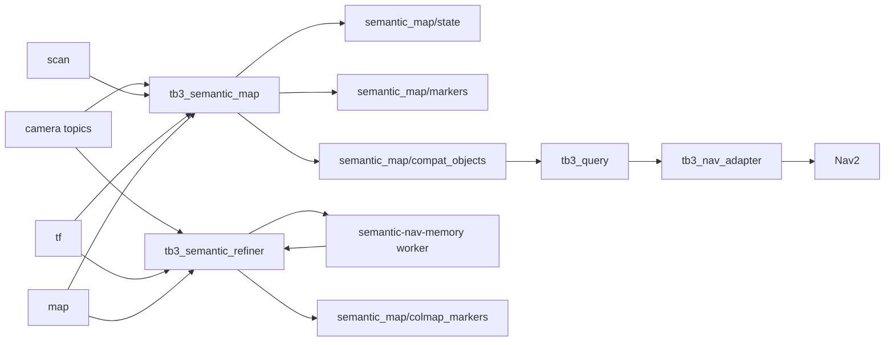
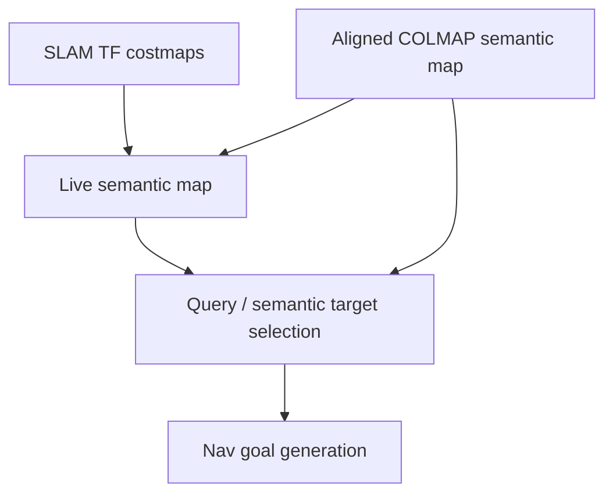

# Live Semantic Map Architecture

## 1. Purpose

This document explains the architecture of the new semantic mapping system, how it relates to the current TurtleBot3 stack, and how the `semantic-nav-memory` project fits into it.

The central architectural rule is:

**navigation consumes a live semantic map in ROS2 `map`, while COLMAP produces a richer aligned semantic reference beside it.**

## 1.1 Mermaid overview



## 2. High-level architecture

```text
                           +----------------------+
                           |   SLAM / Nav2 stack  |
                           |   /map + TF + Nav2   |
                           +----------+-----------+
                                      |
                                      v
  +-------------+    +----------------+----------------+    +----------------------+
  | /camera/... |    |     tb3_semantic_map            |    |   tb3_query / nav    |
  | /scan       | -> | detect + ground + persist +     | -> | select target /      |
  | /tf         |    | place/relation/anchor builders  |    | produce goal pose    |
  | /map        |    +----------------+----------------+    +----------------------+
  +-------------+                     |
                                      v
                           /semantic_map/state
                           /semantic_map/markers
                           /semantic_map/compat_objects

                                      ^
                                      |
                     +----------------+----------------+
                     |      tb3_semantic_refiner       |
                     | frame buffer + worker bridge +  |
                     | reconstruction-to-map alignment |
                     +----------------+----------------+
                                      |
                                      v
                           semantic-nav-memory worker
                           COLMAP + richer scene graph
```

## 3. What the current system does

The current semantic pipeline is already enough to prove command-driven semantic navigation, but it is intentionally narrow.

```text
camera -> 2D detector -> robot-relative localizer -> object list memory
       -> query by class -> offset goal pose
```

That means:

- semantics are mostly a list of remembered objects
- memory is simple nearest-neighbor merging
- objects are carried as `Detection3DArray`
- navigation reasons about one chosen object point at a time

This is good enough for a demo pipeline, but it is not a general semantic map.

## 4. What the new system changes

The new system introduces a proper semantic-map layer between sensing and navigation.

Instead of treating perception as:

- detections
- then memory entries

the new system treats perception as:

- grounded observations
- persistent entities in `map`
- grouped places
- semantic relations
- navigation-facing anchors

This produces a world model, not just an object list.

## 5. Core architectural boundaries

## 5.1 SLAM boundary

The 2D SLAM stack remains the owner of:

- `/map`
- robot localization
- costmaps
- navigation geometry

The semantic system reads those products but does not mutate them.

## 5.2 Live semantic boundary

The live semantic map owns:

- the current semantic state used for navigation
- persistent semantic entities in `map`
- current places / relations / anchors
- ROS2-native debug visibility

This is the authoritative semantic layer for navigation.

## 5.3 Refinement boundary

The COLMAP / `semantic-nav-memory` path owns:

- richer scene-graph reconstruction from buffered image sequences
- alignment of the reconstruction into the simulator `map`
- semantic reference overlays and optional semantic enrichment

It is not part of the hard real-time path.

## 5.4 Authority flowchart



## 6. Live semantic-map subsystem breakdown

## 6.1 Sensor ingest

Inputs:

- `/camera/image_raw`
- `/camera/camera_info`
- `/scan`
- `/tf`
- `/map`

Responsibilities:

- capture images for semantic inference
- capture geometry and frame context
- throttle or sample frames
- keep synchronized data caches

## 6.2 Detector subsystem

Responsibilities:

- run semantic detection on sampled RGB frames
- produce label, confidence, and image-space geometry
- optionally render debug images

The first milestone can reuse the current practical detector setup instead of introducing a new detection research problem.

## 6.3 Grounding subsystem

Responsibilities:

- convert image-space detections into map-frame observations
- use image geometry, scan returns, and robot pose
- reject weak or unsupported observations
- assign per-observation confidence and covariance

This is the critical bridge from camera perception into navigation-usable semantics.

## 6.4 Entity memory subsystem

Responsibilities:

- merge repeated observations into stable semantic entities
- maintain stable ids
- smooth poses
- age stale entities
- expose current active semantic state

Unlike the current object memory, this subsystem works directly in `map`.

## 6.5 Place / relation / anchor subsystem

Responsibilities:

- group related entities into places
- infer simple semantic relations
- generate navigation-facing anchors

This is the first layer that turns perception into a richer semantic map.

## 6.6 Publication subsystem

Responsibilities:

- publish machine-readable semantic state
- publish RViz markers
- publish compatibility exports for the legacy query/nav chain
- publish operator diagnostics

## 7. Compatibility strategy

The system should not require an immediate rewrite of `tb3_query` and `tb3_nav_adapter`.

Instead, the live semantic map publishes:

- `/semantic_map/state` for the new architecture
- `/semantic_map/compat_objects` for the old architecture

That compatibility topic allows the current consumer chain to keep running while the new semantic layer proves itself.

## 8. Asynchronous refinement architecture

## 8.1 Why it exists

`semantic-nav-memory` already knows how to build a richer semantic scene graph from RGB sequences, but it is currently an offline video pipeline. It should be used as a background tool, not forced into the live ROS2 callback path.

## 8.2 Refinement flow

1. The ROS2 bridge buffers RGB frames.
2. It records synchronized robot map poses and camera metadata.
3. It exports a bundle for a worker job.
4. The worker runs `semantic-nav-memory`.
5. COLMAP reconstructs camera centers and sparse geometry.
6. The bridge aligns the reconstruction to `map`.
7. The aligned scene graph is republished into ROS2 as a reference overlay.

## 8.3 Why it does not own navigation

COLMAP output is:

- slower
- potentially fragile under some trajectories
- inherently reconstruction-frame first

That makes it excellent for semantic refinement and analysis, but not the right authority for immediate navigation in this simulator.

## 9. Authority and trust model

At runtime, the system should treat information sources like this:

### Highest trust for navigation geometry

- SLAM `/map`
- TF robot pose
- Nav2 costmaps

### Highest trust for current semantic state

- live map-frame semantic entities from `tb3_semantic_map`

### Secondary trust for semantic enrichment

- aligned COLMAP entities / places / relations from `tb3_semantic_refiner`

If the refinement data disagrees with the live semantic state, the live semantic state wins unless a deliberate merge policy says otherwise.

## 10. Debugging architecture

The browser UI is not required here. The debugging contract is ROS2-native.

Operators should be able to inspect:

- live entities in RViz
- live places in RViz
- live anchors in RViz
- aligned COLMAP overlays in RViz
- semantic-map status topics in a terminal
- compatibility object export with `ros2 topic echo`

This is necessary because the primary consumers of the system are the sim and the ROS2 tools, not the standalone web frontend.

## 11. Native semantic-navigation future

The first migration step keeps query/nav mostly unchanged.

The longer-term architecture should evolve toward:

```text
SemanticMapState
  -> query resolves entity or place or anchor
  -> nav adapter uses anchor directly
  -> Nav2 receives a semantically chosen approach pose
```

That architecture removes the need to flatten the semantic world model back into a Stage-3-style object list.

## 12. Architectural summary

The final architecture is intentionally layered:

1. SLAM owns geometric navigation truth.
2. `tb3_semantic_map` owns live semantic navigation truth.
3. `tb3_semantic_refiner` and `semantic-nav-memory` own richer asynchronous semantic reconstruction.
4. Query and navigation consume the live semantic map first, and optionally benefit from refined semantic context later.

That separation keeps the system practical for robotics while still making use of the richer semantic mapping work.
