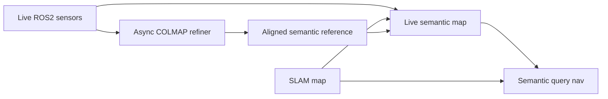
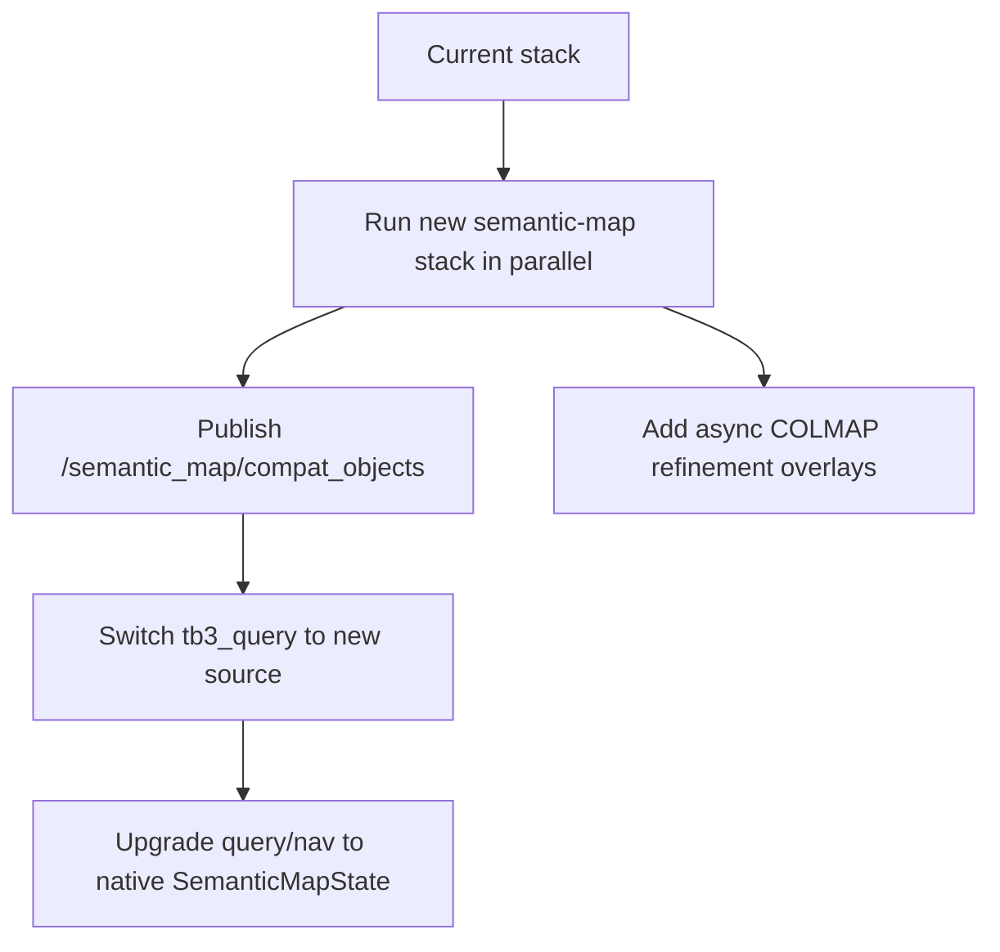
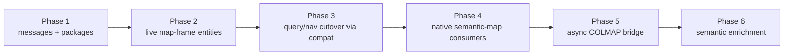
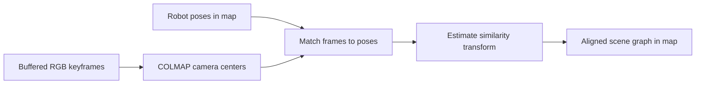

# Live Semantic Map Integration Plan

## 1. Goal

Turn the existing semantic mapping work into a ROS2-friendly semantic-map layer that can consume a live camera sensor, publish a debuggable semantic map in ROS2, and become the semantic world model used by the TurtleBot3 simulation stack for semantic query and navigation.

This plan intentionally separates:

- the **live ROS2 semantic map**, which is authoritative for navigation because it lives in the ROS2 `map` frame
- the **offline / asynchronous COLMAP semantic map**, which acts as a richer semantic reference and refinement artifact
- the **SLAM map**, which remains owned by the existing 2D SLAM stack and is never overwritten by semantic mapping

## 1.1 Mermaid system intent



## 2. Current State

### 2.1 Existing semantic navigation pipeline

The current TurtleBot3 semantic stack is:

```text
camera -> tb3_detector -> tb3_localizer -> tb3_memory -> tb3_query -> tb3_nav_adapter
```

It works like this:

1. `tb3_detector`
   - subscribes to `/camera/image_raw`
   - runs Locate Anything open-vocabulary detection
   - publishes `vision_msgs/Detection2DArray`

2. `tb3_localizer`
   - fuses 2D detections with `/scan`
   - estimates object positions near the robot in `base_link`
   - publishes `vision_msgs/Detection3DArray`

3. `tb3_memory`
   - keeps a simple in-memory nearest-neighbor object registry
   - matches only by label + distance
   - publishes active remembered objects as `vision_msgs/Detection3DArray`

4. `tb3_query`
   - parses text commands such as `go to the person`
   - maps semantic names to detector labels via `semantic_targets.yaml`
   - picks the nearest object of the requested class

5. `tb3_nav_adapter`
   - converts the selected target into an approach `PoseStamped`
   - prefers `map` via TF, but can fall back to `base_link`

### 2.2 Limitations of the current stack

- Memory is still lightweight and mostly object-list style, not a rich semantic map.
- There is no persistent place graph, relation graph, or anchor layer.
- The semantic memory output is shaped for simple object selection, not for general semantic reasoning.
- There is no authoritative ROS2 semantic-map state in `map`.
- `semantic-nav-memory` is currently offline and video-driven, not wired into ROS2 topics.
- The placeholder `semantic_goals.yaml` and fake semantic navigation flow were removed so the supported runtime stays aligned with the real semantic stack.

### 2.3 Important constraint

The simulator's live navigation depends on a 2D SLAM map and robot pose. A COLMAP reconstruction can be aligned to that map and used for semantic reference, but it must not replace or mutate the SLAM map.

## 3. Target End State

After implementation, the system should have two coordinated semantic layers.

### 3.1 Live semantic-map path

This path runs continuously in ROS2 and is the navigation-facing source of truth:

```text
camera + camera_info + scan + tf + map
  -> semantic map ingest / detector / grounding
  -> map-frame entity memory
  -> place / relation / anchor builders
  -> /semantic_map/state
  -> query / nav
```

Responsibilities:

- consume live camera images
- run semantic detection on sampled frames
- ground detections directly into ROS2 `map`
- maintain persistent map-frame semantic entities
- infer places, relations, and semantic anchors
- publish debug markers and machine-readable state
- expose a compatibility output so current query/nav code can be reused during migration

### 3.2 Asynchronous COLMAP semantic-refinement path

This path runs beside the live stack:

```text
buffered RGB frames + camera metadata + robot map poses
  -> semantic-nav-memory worker
  -> COLMAP reconstruction + richer scene graph
  -> reconstruction-to-map alignment
  -> aligned semantic reference artifacts
  -> ROS2 reference overlay / optional semantic refinement
```

Responsibilities:

- process buffered clips or operator-triggered captures
- run the existing `semantic-nav-memory` pipeline outside the live ROS2 callback path
- align the reconstructed scene graph into the ROS2 `map` frame using known robot poses and 2D geometry constraints
- publish aligned entities, places, relations, and anchors for debugging and later semantic enrichment

The COLMAP output may refine or supplement the semantic layer, but it never drives SLAM and never rewrites the occupancy map.

## 4. Design Decisions

### 4.1 Authority model

- `map` from SLAM remains the authoritative geometry for navigation.
- The live semantic map is the authoritative semantic source for query and navigation.
- The COLMAP-aligned semantic map is a secondary semantic reference layer.

### 4.2 Migration strategy

Use a **parallel validation** cutover:

- keep the current detector/localizer/memory chain available
- add the new semantic-map stack in parallel
- switch `tb3_query` to a compatibility topic from the new stack first
- later move query/nav to native semantic-map messages

This avoids blocking the project on a big-bang rewrite.

### 4.3 Runtime split

- ROS2 nodes stay ROS2-native and map-frame aware.
- `semantic-nav-memory` becomes an external worker / library for asynchronous refinement.
- No browser UI work is required for this milestone.
- ROS2 topics and RViz markers are the primary debugging surfaces.

## 4.4 Migration flowchart



## 5. New Runtime Architecture

## 5.1 New ROS2 packages and roles

### `tb3_semantic_map_msgs`

Define new interfaces:

- `SemanticEntity.msg`
- `SemanticPlace.msg`
- `SemanticRelation.msg`
- `SemanticAnchor.msg`
- `SemanticMapState.msg`
- optional status / diagnostic messages if needed

These messages carry the machine-readable semantic world model in the ROS2 `map` frame.

### `tb3_semantic_map`

Primary live semantic-map package. It should contain:

- image ingest and frame sampler
- detector wrapper
- map-frame grounding logic
- entity memory core
- place / relation / anchor builders
- compatibility publisher to `vision_msgs/Detection3DArray`
- RViz marker publisher
- diagnostics / status outputs

### `tb3_semantic_refiner`

Asynchronous worker bridge between ROS2 and `semantic-nav-memory`. It should contain:

- clip buffering and export
- synchronized camera metadata export
- synchronized robot pose export
- worker launch / job control
- reconstruction-to-map alignment
- ROS2 publication of aligned COLMAP semantic artifacts

## 5.2 Topic-level design

### Primary live semantic topics

- `/semantic_map/state`
  - type: `tb3_semantic_map_msgs/SemanticMapState`
  - authoritative live semantic map

- `/semantic_map/markers`
  - type: `visualization_msgs/MarkerArray`
  - live entities / places / anchors for RViz

- `/semantic_map/status`
  - type: `std_msgs/String` or a small diagnostic message
  - human-readable runtime state

### Legacy-compatibility topic

- `/semantic_map/compat_objects`
  - type: `vision_msgs/Detection3DArray`
  - live semantic-map entities exported in the current Stage-3-compatible format

This lets `tb3_query` switch sources before its internals are rewritten.

### COLMAP refinement topics

- `/semantic_map/colmap_markers`
  - aligned COLMAP entities / places / path overlays for RViz

- `/semantic_map/colmap_state`
  - optional machine-readable aligned scene graph projection

- `/semantic_map/refiner_status`
  - worker / job state

## 5.3 Data model rules

### Semantic entities

Each live entity should include:

- stable `entity_id`
- `semantic_name`
- `detector_label`
- label distribution or confidence
- `pose` in `map`
- pose covariance / confidence
- extent estimate
- observation count
- supporting observations
- lifecycle state
- last seen timestamp

### Semantic places

Places should group related entities in `map` and expose:

- stable `place_id`
- place type distribution
- anchor pose
- member entity ids
- extent / footprint
- confidence

### Semantic relations

Relations should be simple and conservative in v1:

- `near`
- `inside`
- `supports`
- optional directional relations if confidence is sufficient

### Semantic anchors

Anchors represent navigation-facing target poses derived from semantic entities or places:

- approach / inspection anchors
- confidence
- target entity or place id
- pose in `map`

Anchors are the preferred future handoff into semantic navigation.

## 6. Detailed Implementation Phases

## Phase 1 — Interfaces and package scaffolding

Build the interfaces and package structure first.

Tasks:

- add `tb3_semantic_map_msgs`
- define stable message schemas
- add `tb3_semantic_map`
- add `tb3_semantic_refiner`
- add package manifests, setup files, launch files, configs, and README stubs

Outputs:

- compilable ROS2 workspace with empty but valid packages
- agreed topic names and message contracts



## Phase 2 — Live map-frame entity pipeline

Build the first useful end-to-end semantic map without COLMAP.

Tasks:

- subscribe to `/camera/image_raw`, `/camera/camera_info`, `/scan`, `/tf`, and `/map`
- sample frames at a configurable rate instead of every camera frame
- run object detection on sampled images
- project detections into bearing space
- fuse scan returns and robot pose to place observations directly into `map`
- create a persistent map-frame entity memory
- publish `SemanticMapState`
- publish `/semantic_map/compat_objects`
- publish RViz markers

Expected behavior:

- the system can build persistent semantic objects in `map`
- the objects are visible in RViz
- query/nav can be pointed at the compatibility export

## Phase 3 — Query/nav cutover through compatibility mode

Switch the semantic consumer without rewriting everything at once.

Tasks:

- add launch/config switch to choose memory source:
  - legacy `/semantic_memory_node/objects`
  - new `/semantic_map/compat_objects`
- validate current `tb3_query` and `tb3_nav_adapter` against the new source
- preserve `semantic_targets.yaml` as the commandable target registry

Expected behavior:

- `go to the person` works using the new semantic map as the upstream source
- current semantic memory path can still be launched for comparison

## Phase 4 — Native semantic-map consumption

Remove the compatibility bottleneck once the live map is stable.

Tasks:

- update `tb3_query` to consume `SemanticMapState` directly
- select entities or anchors from semantic-map data instead of only flat objects
- update `tb3_nav_adapter` to prefer semantic anchors when available
- keep compatibility export only for transition and debugging

Expected behavior:

- navigation can target richer semantic structures than a plain object point
- command resolution remains stable and deterministic

## Phase 5 — Asynchronous COLMAP refinement bridge

Bring in `semantic-nav-memory` without moving it into the live ROS2 loop.

Tasks:

- create rolling frame / metadata buffer
- export buffered clips or on-demand capture bundles
- save per-frame robot map poses and camera metadata
- create worker entrypoint that runs `semantic-nav-memory` on those bundles
- align reconstruction into `map`
- publish aligned reference overlays in ROS2

Expected behavior:

- operator can inspect aligned COLMAP semantic overlays in RViz
- scene graph output becomes available for comparison with the live map

## Phase 6 — Semantic enrichment from aligned reference map

Use the COLMAP outputs carefully to improve semantics without undermining navigation.

Tasks:

- map aligned COLMAP entities to live semantic entities when confidence is sufficient
- import richer place and relation candidates
- attach refinement metadata to live entities instead of replacing them blindly
- preserve provenance:
  - live ROS2 observation
  - aligned COLMAP inference

Expected behavior:

- richer places, relations, and anchors become available
- navigation still relies on live map-frame semantics

## 7. Alignment Strategy for COLMAP Output

## 7.1 Goal

Convert COLMAP reconstruction coordinates into the simulator `map` frame with reasonable scale and orientation so the result is interpretable beside the SLAM map.

## 7.2 Inputs to alignment

- buffered RGB keyframes
- per-frame robot pose in `map`
- camera intrinsics
- scan-derived planar geometric cues
- known camera-to-base extrinsics

## 7.3 Alignment method

Use robot pose history as the primary correspondence source.

At a high level:

1. Capture keyframes and record their corresponding robot poses in `map`.
2. Let COLMAP recover camera centers in reconstruction coordinates.
3. Match keyframe camera centers to robot-pose samples by timestamp / frame id.
4. Estimate similarity transform:
   - scale
   - rotation
   - translation
5. Constrain alignment to preserve the simulator's planar navigation frame:
   - stable XY alignment into `map`
   - Z retained only as semantic reference
6. Use scan-derived scale and occupancy consistency as validation, not as an authority override.



## 7.4 Important boundary

Aligned COLMAP geometry is for semantic reference and enrichment only.

It must not:

- update `/map`
- modify SLAM occupancy cells
- replace Nav2 costmaps
- override robot localization

## 8. How Navigation Will Use the New Semantic Map

## 8.1 V1 behavior

In v1, navigation still resolves user commands through the existing semantic-target registry:

- `table`
- `person`
- `stop_sign`

The difference is that the target now comes from a live semantic map in `map`, not from robot-relative short-term memory.

## 8.2 Target selection

Selection policy should remain deterministic:

- filter by canonical semantic name
- consider only active, sufficiently confident entities or anchors
- choose the best candidate by distance and confidence rules

If an anchor exists for an entity, prefer the anchor over the raw entity center.

## 8.3 Goal generation

`tb3_nav_adapter` should continue to produce a safe approach pose, but over time it should prefer:

- semantic approach anchor
- fallback to entity pose + stand-off computation

This keeps downstream Nav2 behavior stable while improving semantic precision.

## 9. Debugging and Operator Visibility

The browser UI is not part of this milestone. ROS2-native debugging must be sufficient.

Required debugging surfaces:

- `/semantic_map/state`
- `/semantic_map/status`
- `/semantic_map/markers`
- `/semantic_map/colmap_markers`
- `/semantic_map/refiner_status`
- RViz displays for entities, places, anchors, and aligned reference overlays

Optional but useful:

- image debug topic with rendered detections
- semantic-map diagnostics topic with rates, queue sizes, and alignment confidence

## 10. Package and File-Level Changes

Expected new or changed areas:

- new message package under `dev/turtlebot3/ros2_ws/src/tb3_semantic_map_msgs`
- new live semantic-map package under `dev/turtlebot3/ros2_ws/src/tb3_semantic_map`
- new refiner bridge under `dev/turtlebot3/ros2_ws/src/tb3_semantic_refiner`
- updates to `tb3_query`
- updates to `tb3_nav_adapter`
- launch updates in `tb3_coordinator`
- RViz config updates
- optional `semantic-nav-memory` library entrypoints for worker use

## 11. Validation Plan

## 11.1 Unit validation

- label normalization and mapping
- observation grounding into `map`
- entity matching / aging
- place building
- relation inference
- anchor generation
- compatibility conversion to `Detection3DArray`
- reconstruction-to-map alignment estimation

## 11.2 Simulation integration validation

- run legacy and new semantic paths in parallel
- visualize both in RViz
- switch `tb3_query` between old and new sources
- validate object stability under robot motion and revisits
- validate semantic command success using the new source

## 11.3 Failure-mode validation

- no scan support for a detection
- no TF available
- detector false positives
- stale entities
- failed COLMAP job
- weak reconstruction alignment

The live semantic map must continue operating even if refinement fails.

## 12. Risks and Mitigations

### Risk: detector throughput is too slow for continuous mapping

Mitigation:

- sample frames at a lower rate
- batch or throttle inference
- tune class vocabulary for the sim

### Risk: map-frame grounding is noisy

Mitigation:

- keep scan-window robustness
- smooth entities in `map`
- publish covariance / confidence
- reject weak observations

### Risk: COLMAP alignment is unstable

Mitigation:

- treat COLMAP as asynchronous reference only
- require confidence threshold before semantic enrichment
- keep provenance tags on refined outputs

### Risk: query/nav regressions during migration

Mitigation:

- use compatibility export first
- gate source selection by config
- preserve current deterministic command handling until native semantic-map query is stable

## 13. Defaults Chosen by This Plan

- live ROS2 semantic map is authoritative for navigation
- COLMAP is asynchronous and external to the live ROS2 callback path
- `semantic_targets.yaml` stays the commandable target registry for v1
- compatibility export is the first migration step into query/nav
- RViz and ROS2 topics are the required debug surface
- SLAM map remains untouched by semantic mapping
