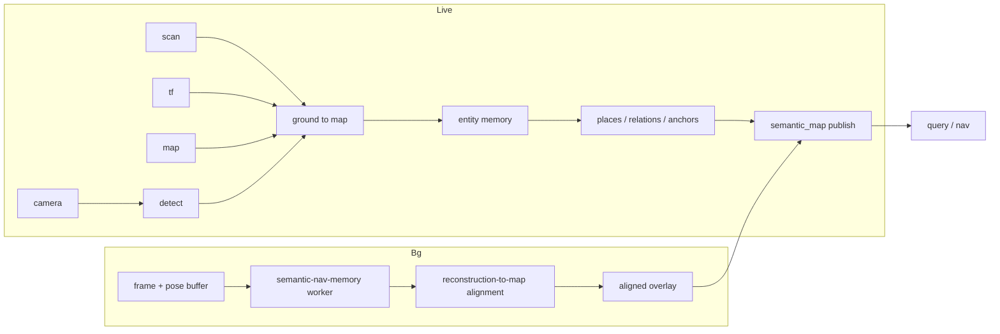
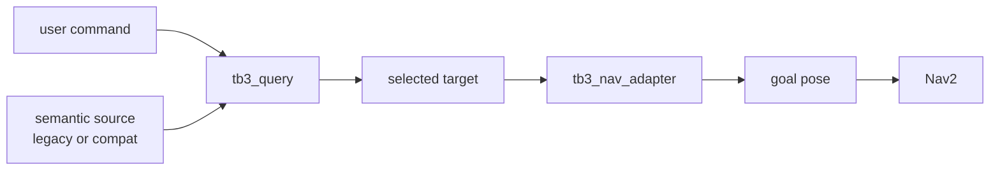
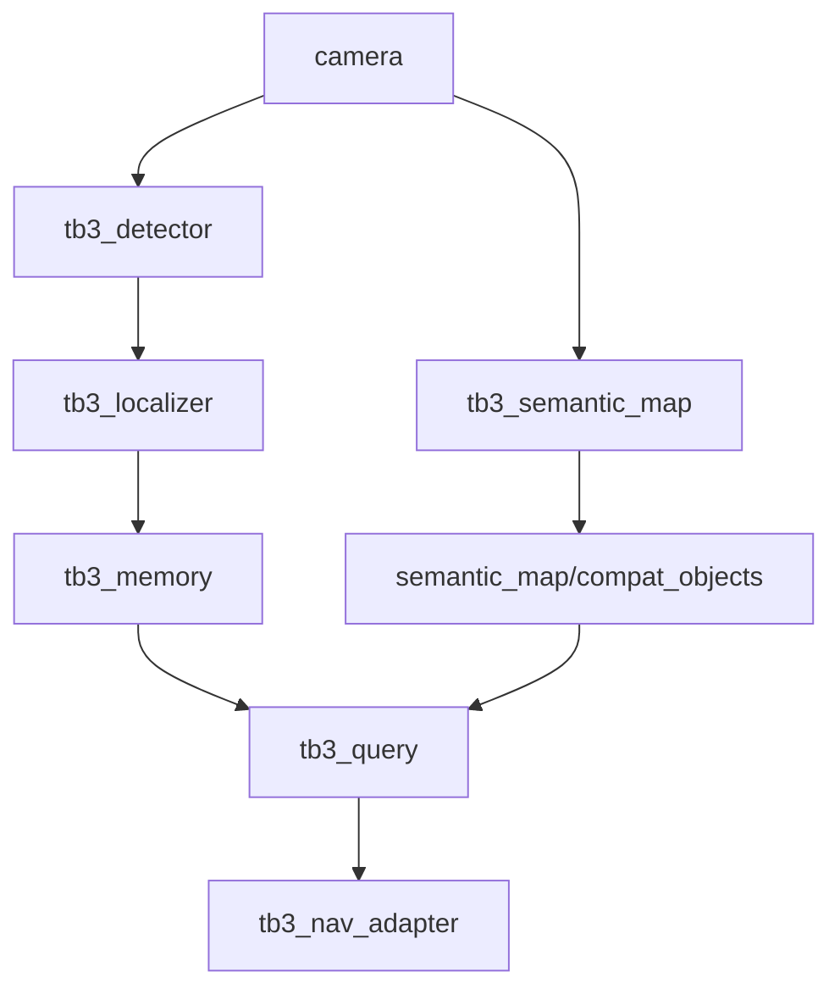

# Live Semantic Map Runtime Flow

## 1. Purpose

This document explains how the new semantic mapping system operates at runtime.

It covers:

- the live ROS2 path
- the asynchronous COLMAP refinement path
- how semantic query and navigation consume the new outputs
- how the new system coexists with the current stack during migration

## 1.1 Mermaid runtime overview



## 2. Runtime flow at a glance

There are two loops:

- a **live loop** for navigation-facing semantics
- a **background loop** for richer semantic refinement

```text
Live loop:
camera + scan + tf + map -> semantic observations -> semantic entities -> query/nav

Background loop:
buffered frames + poses -> semantic-nav-memory -> aligned scene graph -> semantic overlay/refinement
```

## 3. Live loop step-by-step

## 3.1 Sensor arrival

The semantic-map node subscribes to:

- `/camera/image_raw`
- `/camera/camera_info`
- `/scan`
- `/map`
- TF between camera / base / map

The node caches the latest geometry context and samples frames at a configured rate.

Important behavior:

- camera frames can arrive faster than semantic inference should run
- scan and TF must be recent enough to support grounding
- if the geometric context is too stale, the frame should be skipped

## 3.2 Semantic detection

For each sampled frame:

1. Run semantic detection.
2. Keep the detector label, confidence, and image-space box.
3. Optionally filter labels by configured interest set.
4. Optionally publish an annotated debug image.

The detector output is still not world truth. It is only an image-space observation.

## 3.3 Grounding into `map`

Each detection is converted into a candidate world observation:

1. Convert the image x position into a bearing.
2. Look for a corresponding scan return.
3. Estimate range from scan support.
4. Convert range + bearing into a robot-relative point.
5. Transform that point into `map` using TF.
6. Reject the observation if any required support is missing or weak.

Output of this step:

- semantic observation in `map`
- confidence
- supporting metadata

This is the first point where the system has navigation-usable semantic geometry.

## 3.4 Entity memory update

Each grounded observation is compared against existing live entities:

1. filter candidate entities by class
2. compare in map-frame distance
3. update an existing entity if matched
4. otherwise create a new entity
5. age stale entities on a timer

The result is a stable set of map-frame semantic entities.

## 3.5 Place, relation, and anchor rebuild

At a controlled cadence, the live semantic map derives:

- places from clustered entities
- relations from entity / place geometry
- anchors from entity or place geometry

These derived products need not update on every image callback. They can be rebuilt periodically from the current entity set.

## 3.6 Publication

The semantic-map node publishes:

- `/semantic_map/state`
- `/semantic_map/markers`
- `/semantic_map/status`
- `/semantic_map/compat_objects`

The compatibility output is a temporary flattening of the live semantic map back into the old object-list format.

## 4. Query and navigation flow



## 4.1 Compatibility mode

During the transition, `tb3_query` reads from:

- legacy `/semantic_memory_node/objects`, or
- new `/semantic_map/compat_objects`

depending on configuration.

Its behavior remains the same:

1. parse command
2. map semantic name to detector label
3. search objects
4. pick best target

That preserves the working command path while the semantic map is being introduced.

## 4.2 Native semantic-map mode

Later, `tb3_query` should read `SemanticMapState` directly.

That allows it to:

- target entities instead of flattened detections
- target places if needed
- prefer anchors over raw object centers

Then `tb3_nav_adapter` can generate approach goals from semantic anchors instead of only offsetting from a raw point.

## 4.3 Relational query behavior

In native semantic-map mode, `tb3_query` can resolve simple relational commands against `SemanticMapState`.

Supported forms:

- `go to the person`
- `go to the person near the table`
- `go to the person next to the table`
- `go to the person left of the table`
- `go to the person right of the table`

Important runtime rules:

- canonical stored runtime relation remains `near`
- `next to`, `left of`, and `right of` are interpreted as user-language aliases for proximity
- relational queries require `memory_mode=semantic_map_state`
- ranking is based on:
  1. strongest relation confidence
  2. nearest selected target to the robot
  3. target confidence
- once a target is chosen, semantic anchors are still preferred downstream when available

This keeps the robot-facing semantics conservative and geometry-defensible while still supporting more natural command language.

## 5. Background refinement loop

## 5.1 Buffering

The refiner bridge continuously or on demand stores:

- sampled RGB frames
- timestamps
- camera metadata
- robot poses in `map`

This creates a refinement bundle.

## 5.2 Worker execution

The bridge hands the bundle to `semantic-nav-memory`.

That worker:

1. extracts keyframes if needed
2. runs COLMAP reconstruction
3. runs semantic detection
4. grounds detections into reconstruction space
5. fuses entities
6. builds places, relations, and anchors
7. writes a scene graph

The worker is not part of the live loop and can fail without taking down live semantic navigation.

## 5.3 Alignment into ROS2 `map`

Once the worker finishes:

1. match reconstructed camera centers to stored robot poses
2. estimate scale + rotation + translation into `map`
3. transform the scene graph into `map`
4. compute an alignment confidence
5. reject or quarantine weak solutions

Once aligned, the outputs can be visualized in RViz and optionally used for semantic refinement.

## 5.4 Refinement consumption

The aligned reference outputs are used carefully:

- always useful for visualization
- optionally useful for semantic enrichment
- never authoritative for SLAM geometry
- never required for basic semantic navigation

## 6. Failure handling

## 6.1 Live-loop failures

If the live semantic-map node lacks:

- valid scan
- valid TF
- camera info
- map

then it should skip unsupported observations rather than publish misleading world positions.

The live loop must continue running as partial data arrives.

## 6.2 Refiner failures

If the background refiner fails:

- log the failure
- publish refiner status
- preserve old or no refinement overlay
- keep the live semantic map running

The live loop must never depend on a completed refiner job.

## 7. Migration runtime story

During migration, the runtime should support both stacks:



### Legacy path

```text
camera -> detector -> localizer -> memory -> query -> nav_adapter
```

### New path

```text
camera + scan + tf + map -> semantic_map -> compat_objects -> query -> nav_adapter
```

This allows side-by-side comparison:

- topic inspection
- RViz inspection
- command success comparison
- object stability comparison

Once the new path is stable, query and nav can switch to native semantic-map messages.

## 8. Runtime summary

At runtime, the system works because the responsibilities are cleanly split:

- live ROS2 path provides immediate semantic state for navigation
- background COLMAP path provides richer semantic structure for reference and refinement
- SLAM remains in charge of geometric navigation truth
- query/nav can migrate incrementally instead of being rewritten all at once

That is the intended operating model for this semantic-map integration.
