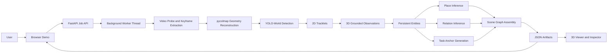
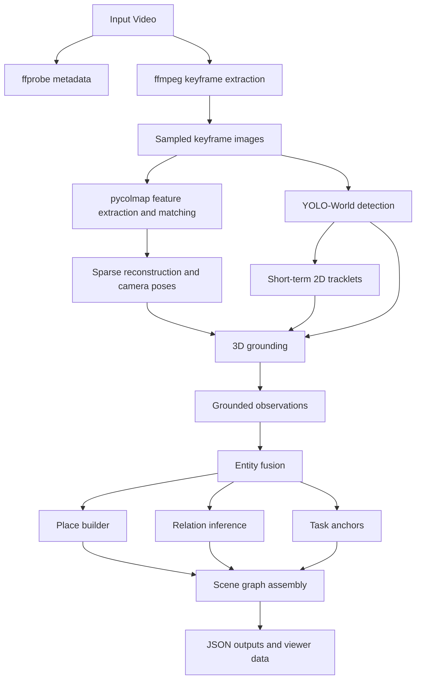
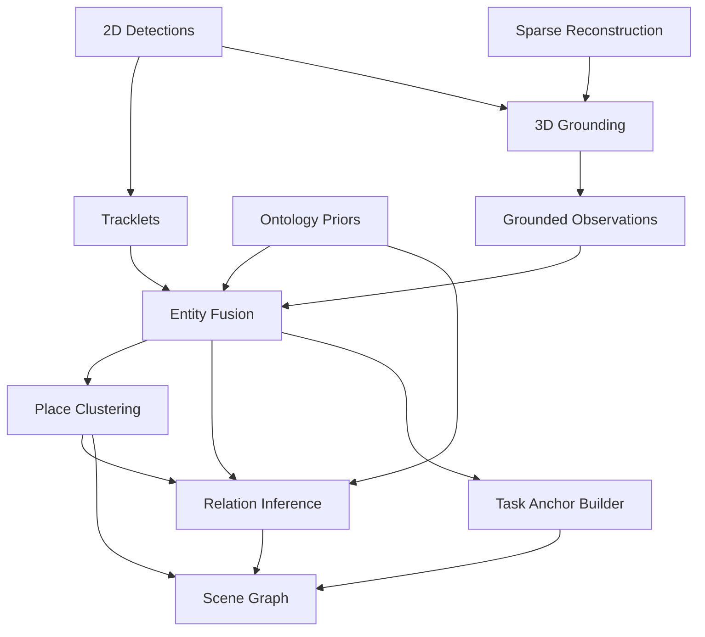
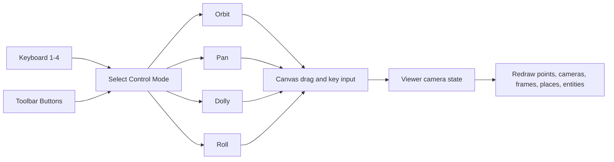

# Semantic Mapping System Report

## Purpose

This report explains how the current `semantic-nav-memory` implementation works, how data moves through the system, what semantic detail is actually being inferred, how the browser demo is structured, and what kinds of videos produce the best results.

The implementation in this repository is a working monocular semantic mapping MVP built around:

- `pycolmap` for sparse monocular reconstruction
- `YOLO-World` for open-vocabulary object detection
- a lightweight semantic fusion layer for persistent entities, places, and relations
- a FastAPI backend with a browser-based 3D inspection interface

It is not a full dense scene-understanding stack yet, but it is also not just "detector labels at coordinates." It produces a structured scene graph with world-level entities, place groupings, relation hypotheses, and task anchors.

## High-Level Summary

At a high level, the system does five things:

1. Accept a video upload and create a background job.
2. Extract keyframes and reconstruct the camera trajectory plus a sparse 3D map.
3. Detect semantic objects in those keyframes with `YOLO-World`.
4. Ground detections into the reconstructed 3D frame and fuse them into persistent entities.
5. Infer places, relations, and task anchors, then expose all artifacts to the browser viewer.

## System Architecture

## Main Runtime Flow

### 1. Job Creation and Upload

The backend entry point is [`semantic_nav_memory/server.py`](/Users/illumination/Projects/semantic-nav-memory/semantic_nav_memory/server.py).

The browser uploads:

- a video file
- an optional prompt vocabulary override

The server then:

- allocates a `job_id`
- writes the input file under `data/jobs/<job_id>/input/`
- writes an initial `job.json`
- starts a background worker thread

This is intentionally simple right now. The job runner is in-process, not distributed.

### 2. Pipeline Execution

The orchestration layer is [`semantic_nav_memory/pipeline.py`](/Users/illumination/Projects/semantic-nav-memory/semantic_nav_memory/pipeline.py).

The pipeline stages are:

1. `probe_video`
2. `extract_keyframes`
3. `reconstruct_geometry`
4. `run_yolo_world`
5. `build_tracklets`
6. `ground_observations`
7. `fuse_entities`
8. `infer_places`
9. `infer_relations`
10. `build_scene_graph`

Each stage writes one or more JSON artifacts into `data/jobs/<job_id>/outputs/`.

## Backend Processing Flow

## Reconstruction Layer

The geometry backend is [`semantic_nav_memory/geometry_colmap.py`](/Users/illumination/Projects/semantic-nav-memory/semantic_nav_memory/geometry_colmap.py).

It currently does the following:

- uses `pycolmap.extract_features`
- uses `pycolmap.match_exhaustive`
- runs incremental monocular mapping
- selects the best reconstruction by registered image count and point count
- exports sparse points and camera poses
- PCA-aligns the reconstruction for easier viewing

Important details:

- The map is monocular and therefore relative-scale by default.
- The exported frame is an inspection frame, not a metric robotics frame.
- PCA alignment makes the viewer easier to read, but it is not a gravity or floor calibration.

## Detection Layer

The detector backend is [`semantic_nav_memory/detector_yoloworld.py`](/Users/illumination/Projects/semantic-nav-memory/semantic_nav_memory/detector_yoloworld.py).

It currently:

- loads `yolov8s-worldv2.pt`
- sets a constrained prompt vocabulary
- runs detection on extracted keyframes
- writes annotated preview frames

The default prompt set is defined in:

- [`semantic_nav_memory/config.py`](/Users/illumination/Projects/semantic-nav-memory/semantic_nav_memory/config.py)
- [`semantic_nav_memory/prompts.yaml`](/Users/illumination/Projects/semantic-nav-memory/semantic_nav_memory/prompts.yaml)

The point of the constrained vocabulary is stability. The system is trying to produce a useful scene graph, not maximize open-vocabulary noise.

## Grounding and Fusion

The key semantic transition in the system is:

- 2D detections are not treated as world truth
- they become 3D observations only if they can be supported by the reconstruction
- observations then get fused into persistent entities

The modules involved are:

- [`semantic_nav_memory/tracker_2d.py`](/Users/illumination/Projects/semantic-nav-memory/semantic_nav_memory/tracker_2d.py)
- [`semantic_nav_memory/grounder_3d.py`](/Users/illumination/Projects/semantic-nav-memory/semantic_nav_memory/grounder_3d.py)
- [`semantic_nav_memory/entity_memory.py`](/Users/illumination/Projects/semantic-nav-memory/semantic_nav_memory/entity_memory.py)

Current grounding behavior:

- detections are associated with sparse points whose image observations fall inside the detection bounding box
- those supporting points are averaged into a 3D centroid
- covariance and extent are estimated from the same supporting points
- detections with no supporting sparse points are dropped from the 3D semantic layer

This is one of the reasons some videos feel "flat" or sparse. If the reconstruction has weak parallax or poor support in object regions, the semantic layer has less 3D evidence to attach to.

## Semantic Detail: What Is Actually Inferred

Yes, the system is currently doing semantic detail beyond simple object localization.

The ontology lives in [`semantic_nav_memory/ontology.yaml`](/Users/illumination/Projects/semantic-nav-memory/semantic_nav_memory/ontology.yaml) and provides:

- aliases
- parent classes
- mobility
- support priors
- place priors

### Entity Level

The entity layer stores:

- canonical label
- class distribution
- aliases
- ontology parents
- 3D pose estimate
- covariance
- 3D extent
- place membership
- support surface assignment
- state and confidence

### Place Level

The place layer groups nearby entities into place-like clusters such as:

- workspace-like areas
- room clusters
- transition zones

### Relation Level

The current relation logic in [`semantic_nav_memory/relation_inference.py`](/Users/illumination/Projects/semantic-nav-memory/semantic_nav_memory/relation_inference.py) emits:

- `near`
- `left_of`
- `right_of`
- `in_front_of`
- `behind`
- `on`
- `on_top_of`
- `under`
- `inside`
- `in_place`
- `seen_from_place`

These are inferred from:

- 3D displacement
- extent overlap
- support priors from the ontology
- shared place membership
- shared observation evidence

This means the current system can already express relationships like:

- `cup_02 on_top_of table_01`
- `monitor_01 in_place workspace_place_01`
- `keyboard_01 near monitor_01`
- `backpack_01 inside cabinet_01`

The important caveat is that these are still heuristic relation hypotheses, not dense physical reasoning or full symbolic truth.

## Semantic Fusion Flow

## Browser Demo

The frontend lives under:

- [`frontend/index.html`](/Users/illumination/Projects/semantic-nav-memory/frontend/index.html)
- [`frontend/app.js`](/Users/illumination/Projects/semantic-nav-memory/frontend/app.js)
- [`frontend/viewer.js`](/Users/illumination/Projects/semantic-nav-memory/frontend/viewer.js)
- [`frontend/app.css`](/Users/illumination/Projects/semantic-nav-memory/frontend/app.css)

The browser does four main jobs:

1. Upload a video and prompt set.
2. Poll the job API for progress.
3. Load the generated `scene_graph.json`.
4. Render a 3D inspection view with entity selection and frame billboards.

### What the Viewer Shows

The viewer can currently render:

- sparse reconstruction points
- camera positions and path
- projected keyframe thumbnails at camera positions
- persistent entities
- inferred places

The frame thumbnails are important because they add visual grounding to an otherwise abstract sparse map.

## Viewer Interaction Model

The 3D controller supports mode-based interaction rather than a single drag behavior.

Available modes:

- `Orbit`
- `Pan`
- `Dolly`
- `Roll`

Shortcuts:

- `1` switch to orbit
- `2` switch to pan
- `3` switch to dolly
- `4` switch to roll
- `R` reset view
- `[` rotate left by a quarter turn
- `]` rotate right by a quarter turn

## Viewer Interaction Flow

## Current Output Artifacts

Each job currently writes:

- `video_metadata.json`
- `reconstruction.json`
- `detections.json`
- `tracklets.json`
- `observations.json`
- `entities.json`
- `places.json`
- `relations.json`
- `task_anchors.json`
- `scene_graph.json`

These artifacts are intended to stay modular so future upgrades can improve one layer without rewriting the whole representation.

## Why Some Reconstructions Look Flat

The "flat" look usually comes from the input video and monocular constraints, not only from the viewer.

Typical causes:

- low parallax
- mostly rotational camera motion
- portrait footage with weak side-to-side translation
- repeated low-texture surfaces
- motion blur
- small objects with weak sparse-point support

In this system specifically, flatness is amplified because:

- reconstruction is sparse rather than dense
- 3D grounding depends on sparse points inside detection boxes
- monocular scale is relative
- there is no explicit floor or gravity alignment yet

## Video Recommendations

To get better maps, the input video should ideally:

- be landscape if possible
- last about 10 to 30 seconds
- move slowly with lateral parallax
- revisit the same scene from slightly different angles
- keep at least three depth layers in frame
- include textured surfaces and stable lighting
- avoid heavy blur, abrupt pans, and dynamic people

Good motion pattern:

- walk or sidestep in short arcs around the scene
- keep objects in frame while moving sideways
- avoid only turning in place

Bad motion pattern:

- quick portrait sweep
- constant rotation around one point with little translation
- low-light handheld shake

## Current Strengths

- Real monocular reconstruction pipeline with `pycolmap`
- Real open-vocabulary detector with `YOLO-World`
- Persistent world entities instead of frame-local detections only
- Place and relation graph output
- Browser-based inspection loop
- Frame billboards for visual grounding in the 3D view

## Current Limitations

- Sparse geometry only
- Relative scale only
- Heuristic relation inference
- No dense mesh or dense point cloud yet
- No segmentation-backed support reasoning yet
- No explicit robot runtime reintegration yet
- No live multi-user or queued job backend

## Practical Interpretation

The current system should be interpreted as:

- a functioning semantic mapping research scaffold
- a real video-to-scene-graph pipeline
- a browser-inspectable monocular semantic map

It should not yet be interpreted as:

- metric ground truth
- fully reliable dense scene understanding
- final robotics deployment code

## Recommended Next Upgrades

If the next goal is stronger semantic mapping quality rather than interface refinement, the most valuable upgrades are:

1. Add denser geometry or mesh-backed grounding.
2. Add segmentation or mask-based support reasoning.
3. Add better support-surface modeling and floor estimation.
4. Add frustum rendering and per-camera thumbnails with depth-aware scaling.
5. Add richer relation confidence logic and relation debugging views.
6. Add a better sample dataset so the demo always has a strong default input.

## Conclusion

This repository now implements the intended first shape of the monocular semantic mapping plan:

- video in
- sparse reconstruction
- semantic detection
- 3D grounding
- persistent entity memory
- places
- relations
- task anchors
- scene graph out
- browser viewer for inspection

The semantic layer already includes meaningful relation types such as `on_top_of`, `under`, `inside`, and place membership. The main remaining gaps are reconstruction richness and grounding quality, not the overall architecture.
