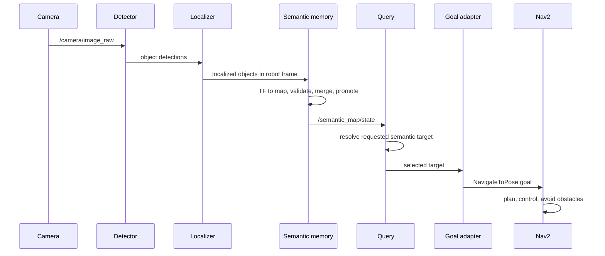
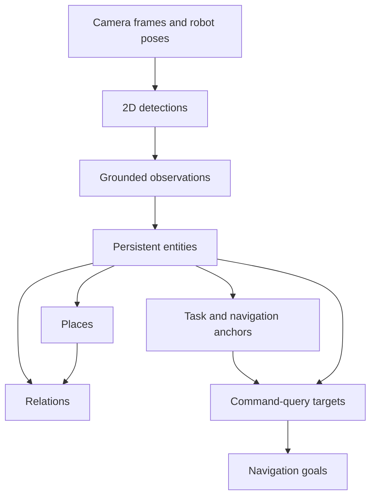
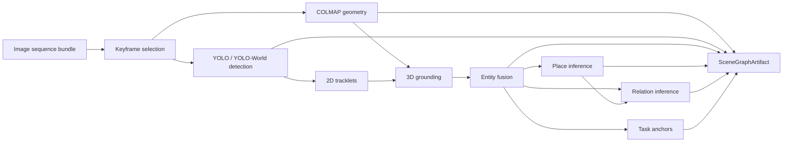
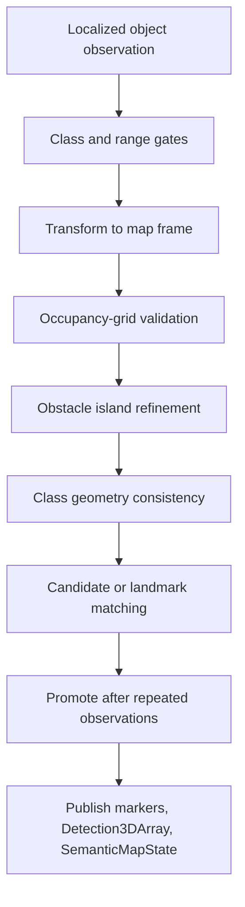
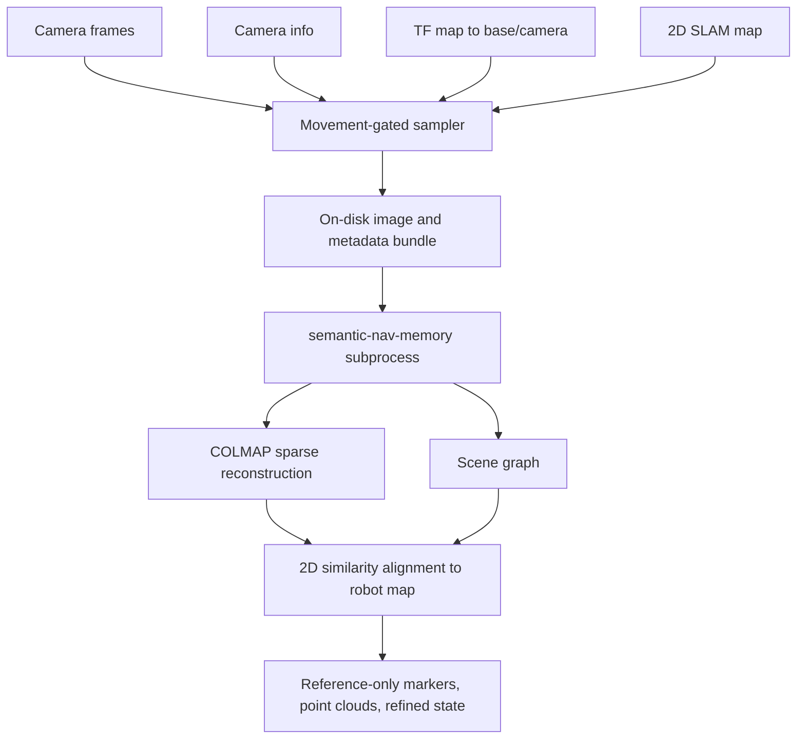

# Semantic Navigation System Writeup

> Isaac port note: NVIDIA Isaac Sim 6.0.1 now owns the simulation boundary.
> The ROS 2 semantic architecture described below is unchanged; Gazebo-specific
> passages are retained as historical implementation context. See
> `docs/ISAAC_SIM_PORT.md` for current operation.

This document accompanies the semantic navigation architecture deck:

- `docs/semantic_nav_architecture_figures.pptx`
- `docs/semantic_nav_architecture_figures.pdf`

It explains how the current system works, what was changed during this build-out, how the semantic mapping dependency is used, and how the robot-facing architecture is intended to transfer from simulation to a real TurtleBot3 Waffle-class robot with a Jetson Orin.

## Executive Summary

The system turns raw robot perception into a navigation-facing semantic map. The robot uses normal ROS2 navigation primitives for motion, SLAM, obstacle avoidance, and goal execution. The semantic layer sits above that stack. It detects objects in the camera stream, grounds detections into the robot's map frame, filters and stabilizes those detections against robot geometry, publishes a structured semantic map, and lets natural commands resolve to navigation goals.

The important design decision is that the semantic map is not hardcoded. It is built at runtime from the robot's own sensors. The authoritative navigation-facing semantic state is published on `/semantic_map/state` by the persistent semantic memory path. A separate live mapper can publish debug/live semantic outputs, and a COLMAP-based refiner can publish reference-only reconstruction overlays, but navigation should treat the persistent robot-grounded semantic map as the source of truth.

The current architecture is intentionally robot-native. It assumes the real robot has limited geometry sensing: a TurtleBot3-class platform with 2D LiDAR, odometry, TF, and a monocular RGB camera. The 2D LiDAR and SLAM map are the grounding source for safe navigation. COLMAP is used as an enrichment path for additional 3D structure when the robot has enough visual motion, but it does not replace SLAM, does not write into `/map`, and does not inject fake detections.

## Goals

The work was structured around these goals:

- Build a semantic navigation stack that runs in ROS2 and can be used in both simulation and real robot deployment.
- Use the semantic map generated from perception, not a predefined or mocked semantic map.
- Keep the navigation path compatible with TurtleBot3, Nav2, SLAM Toolbox, RViz, and standard ROS2 topics.
- Use LiDAR and SLAM as the safety-critical grounding layer because the robot's LiDAR is 2D and reliable for navigation.
- Use monocular COLMAP reconstruction as optional enrichment for scene understanding when visual motion supports it.
- Avoid fake point clouds, bootstrap people, hardcoded landmarks, and scripts that show artifacts without running the full stack.
- Preserve sim-to-real structure so the same conceptual stack can run in Gazebo and on a real TurtleBot3 without rewriting the architecture.

## Non-Goals

These are explicitly outside the current design:

- COLMAP is not used as the primary obstacle map.
- COLMAP does not write into `/map`, `/scan`, or the Nav2 costmaps.
- The stack does not assume a dense RGB-D camera or 3D LiDAR.
- The real robot launch does not auto-drive on startup.
- Mock detections and fake point clouds are not part of the real/sim validation path.

## High-Level Architecture

At runtime, the robot runs a normal ROS2 navigation stack and a semantic layer in parallel. The semantic layer consumes camera detections, localizes them relative to the robot, validates them against map/scan evidence, and publishes a structured map that query/navigation nodes can consume.

```mermaid
flowchart LR
  subgraph RobotSensors[Robot sensors]
    Camera[RGB camera]
    Lidar[2D LiDAR]
    Odom[Wheel odometry]
    TF[TF tree]
  end

  subgraph Navigation[Robot navigation]
    Slam[SLAM Toolbox]
    Map[/map]
    Nav2[Nav2 planner and controller]
    Costmaps[Local and global costmaps]
  end

  subgraph SemanticLayer[Semantic layer]
    Detector[YOLO detector]
    Localizer[Detection localizer]
    Memory[Persistent semantic memory]
    State[SemanticMapState on /semantic_map/state]
    Query[Semantic query]
    GoalAdapter[Nav goal adapter]
  end

  subgraph Enrichment[Optional visual enrichment]
    Sampler[Movement-gated frame sampler]
    Worker[semantic-nav-memory worker]
    Colmap[COLMAP reconstruction]
    Overlay[Reference-only refined state and point clouds]
  end

  Camera --> Detector
  Detector --> Localizer
  Lidar --> Slam
  Odom --> Slam
  TF --> Slam
  Slam --> Map
  Map --> Memory
  Localizer --> Memory
  Memory --> State
  State --> Query
  Query --> GoalAdapter
  GoalAdapter --> Nav2
  Map --> Nav2
  Lidar --> Costmaps
  Costmaps --> Nav2

  Camera --> Sampler
  TF --> Sampler
  Map --> Sampler
  Sampler --> Worker
  Worker --> Colmap
  Colmap --> Overlay
  Overlay -. reference only .-> State
```

The left side of the graph is the safety-critical robot stack. The right side is semantic enrichment. The boundary matters: a bad semantic reconstruction should not be able to corrupt the robot's SLAM map or costmap.

## Runtime Data Flow

The primary robot-facing flow is:

1. The camera publishes RGB frames on `/camera/image_raw`.
2. The detector node runs YOLO on camera frames and publishes `vision_msgs/Detection2DArray` or the detector package's configured detection output.
3. The localizer projects detections into robot-relative 3D estimates using camera metadata and robot geometry assumptions.
4. The legacy semantic memory path stabilizes localized objects into `vision_msgs/Detection3DArray` on `/semantic_memory_node/objects`.
5. `semantic_map_memory_node` consumes those object observations, transforms them into `map`, validates them against `/map`, and tracks candidates and persistent landmarks.
6. Once enough observations support a candidate, it becomes a persistent semantic landmark.
7. The persistent semantic memory node publishes `SemanticMapState` on `/semantic_map/state`.
8. The query node consumes `/semantic_map/state` and resolves commands such as "go to the table" to a target semantic entity.
9. The navigation adapter converts the selected semantic target into a `NavigateToPose` goal.
10. Nav2 plans and controls the robot using SLAM, costmaps, and standard robot safety constraints.



## ROS2 Package Roles

| Package or node | Role | Main inputs | Main outputs |
| --- | --- | --- | --- |
| `turtlebot3_bringup` | Real robot base bringup | Robot hardware | `/scan`, `/odom`, `/joint_states`, TF |
| `slam_toolbox` through Nav2 bringup | Builds the 2D occupancy map | `/scan`, `/odom`, TF | `/map`, map TF |
| `nav2_bringup` | Plans and executes navigation | `/map`, costmaps, goals | `navigate_to_pose` action |
| `tb3_detector` | Runs object detection on camera frames | `/camera/image_raw` | detector output |
| `tb3_localizer` | Converts image detections into robot-frame object estimates | detections, camera metadata, TF | `/localizer_node/localized_objects` |
| `tb3_memory` | Maintains the existing Detection3D compatibility memory | localized objects | `/semantic_memory_node/objects` |
| `tb3_coordinator/semantic_map_memory_node` | Persistent robot-grounded semantic landmark memory | `/semantic_memory_node/objects`, `/map`, TF | `/semantic_map/state`, markers, compatibility landmarks |
| `tb3_semantic_map` | Live semantic map builder and visualization path | camera, scan, map, TF | live/debug semantic map topics |
| `tb3_query` | Resolves semantic commands to selected targets | `/semantic_map/state` | selected target |
| `tb3_nav_adapter` | Converts semantic target to Nav2 goal | selected target | `NavigateToPose` |
| `tb3_semantic_refiner` | Optional asynchronous COLMAP enrichment bridge | camera, camera info, map, TF | reference-only COLMAP markers, point clouds, refined state |
| `semantic-nav-memory` | Vendored offline/worker semantic mapping dependency | sampled image bundle | scene graph, COLMAP reconstruction, entities, places, relations, anchors |

## Launch Structure

The launch structure separates the robot base, shared semantic stack, and real/sim wrappers.

The shared semantic stack lives in:

```text
dev/turtlebot3/ros2_ws/src/tb3_coordinator/launch/semantic_nav_stack.launch.py
```

It starts the common ROS2 components:

- Nav2 bringup with SLAM enabled.
- Frontier exploration.
- Detector.
- Localizer.
- Semantic memory.
- Persistent semantic map memory.
- Query node.
- Nav goal adapter.
- Coordinator.
- Optional semantic refiner.
- Optional RViz.

The real robot wrapper lives in:

```text
dev/turtlebot3/ros2_ws/src/tb3_coordinator/launch/real_semantic_nav.launch.py
```

It configures the stack for a real TurtleBot3-style robot:

- `use_sim_time:=false`.
- Real Nav2 parameters from `config/nav2/waffle_pi_real_nav2.yaml`.
- Real SLAM parameters from `config/slam/waffle_pi_real_slam.yaml`.
- Real topics such as `/scan`, `/odom`, `/camera/image_raw`, `/camera/camera_info`, and `/map`.
- Motion starts disarmed.
- Exploration starts disabled.
- Readiness checks are required.
- Persistent semantic memory publishes the authoritative `/semantic_map/state`.

The real launch assumes robot bringup is already running:

```bash
export TURTLEBOT3_MODEL=waffle_pi
ros2 launch turtlebot3_bringup robot.launch.py
ros2 launch tb3_coordinator real_semantic_nav.launch.py
```

For the robot we checked, the LiDAR model is LDS-02. The corresponding environment should be set when bringing up the base:

```bash
export LDS_MODEL=LDS-02
```

## Semantic Map Data Model

The semantic map is published as `tb3_semantic_map_msgs/SemanticMapState`.

The message has four top-level semantic layers:

| Layer | Meaning |
| --- | --- |
| `entities` | Object-level semantic landmarks such as a bench, table, chair, door, or other recognized target. |
| `places` | Groupings of related entities into place-like clusters such as workspace, room cluster, lounge, or transition zone. |
| `relations` | Semantic relationships between entities and places, such as `near`, `in_place`, `on_top_of`, or `under`. |
| `anchors` | Navigation or task poses derived from objects, such as an approach pose for a table. |

The ROS2 message definition is:

```text
std_msgs/Header header
string source
bool refinement_active
tb3_semantic_map_msgs/SemanticEntity[] entities
tb3_semantic_map_msgs/SemanticPlace[] places
tb3_semantic_map_msgs/SemanticRelation[] relations
tb3_semantic_map_msgs/SemanticAnchor[] anchors
```

A `SemanticEntity` carries both geometric and semantic information:

```text
std_msgs/Header header
string entity_id
string semantic_name
string detector_label
string place_id
string state
string[] aliases
string[] provenance
geometry_msgs/Pose pose
float64[36] pose_covariance
geometry_msgs/Vector3 extent
float32 confidence
uint32 observation_count
builtin_interfaces/Time last_seen
```

The distinction between `detector_label` and `semantic_name` is deliberate. A detector may output `bench`, but a semantic command may ask for `table`. The mapping layer can preserve the raw detector label while also assigning a semantic name and aliases that make the object usable by command interpretation.

The `provenance` field is important for debugging and safety. It records how the entity was produced, for example:

- `semantic_memory`
- `lidar_grounded`
- `occupancy_grid_validated`
- `occupancy_grid_pending`
- `map_bounds_pending`
- `map_unavailable`

This lets downstream nodes distinguish strongly grounded landmarks from provisional landmarks that are waiting for the SLAM map to catch up.

## Semantic Hierarchy

The semantic navigation dependency uses a hierarchical scene-graph model. The ROS2 version does not copy every offline structure directly, but it preserves the same conceptual hierarchy:



The levels have different stability:

| Level | Stability | Purpose |
| --- | --- | --- |
| Detection | Low | A single frame-level object hypothesis. |
| Observation | Medium | A detection with an estimated pose and evidence. |
| Entity | High | A persistent object identity after repeated observations. |
| Place | Medium/high | A cluster of entities with a place-type hypothesis. |
| Relation | Medium | A relationship hypothesis inferred from geometry and ontology. |
| Anchor | High enough for navigation | A derived target pose that Nav2 can drive toward. |

This hierarchy prevents the robot from navigating to one-off detector noise. The robot should navigate to stable entities or anchors, not raw boxes.

## Semantic-Nav-Memory Dependency Architecture

The vendored dependency is stored at:

```text
dev/turtlebot3/external/semantic-nav-memory
```

It exists so a robot checkout contains the worker source needed by `tb3_semantic_refiner` without requiring a nested Git checkout at deployment time. It provides the monocular semantic mapping pipeline used for optional visual enrichment.

The dependency's internal scene graph includes these Pydantic models:

| Model | Meaning |
| --- | --- |
| `Keyframe` | Sampled image frame with timestamp and image metadata. |
| `CameraPose` | Recovered or aligned camera pose for a keyframe. |
| `ReconstructionPoint` | Sparse 3D COLMAP point with optional color and error. |
| `ReconstructionArtifact` | Camera poses, sparse points, support points, intrinsics, and scene extent. |
| `Detection` | 2D object detection with label, confidence, bounding box, and class distribution. |
| `Tracklet` | Linked detections across frames. |
| `Observation` | 3D grounded detection with covariance, extent, and supporting point IDs. |
| `Entity` | Fused persistent semantic object with aliases, ontology parents, support points, state, and confidence. |
| `Place` | Cluster of entities with a place-type distribution and extent. |
| `Relation` | Subject-predicate-object semantic relationship with evidence frames. |
| `TaskAnchor` | Derived action or inspection target pose. |
| `SceneGraphArtifact` | Full exported semantic scene graph. |

The dependency pipeline is:



The ontology in `semantic_nav_memory/ontology.yaml` provides:

- Aliases, for example `desk` can include `work desk` and `workstation`.
- Parent classes, for example `desk` is furniture, support surface, and workspace anchor.
- Affordances, for example a table is a surface and landmark.
- Mobility assumptions, for example furniture is static and a person is dynamic.
- Support priors, for example a monitor can be supported by a desk, table, or wall boundary.
- Place priors, for example desks, monitors, and keyboards are likely workspace context.

This is more useful than a flat object list because it gives the system vocabulary for reasoning. A command can refer to aliases, a navigation planner can prefer static landmarks, and relations can use support priors to infer `on_top_of`, `under`, or `inside` where geometry supports it.

## Relationship Mapping

The semantic system uses relationships to make object navigation less brittle. Relationships let the robot understand commands and scene structure at a higher level than "go to x,y".

The offline dependency can infer relationships such as:

- `near`
- `in_place`
- `seen_from_place`
- `left_of`
- `right_of`
- `in_front_of`
- `behind`
- `on`
- `on_top_of`
- `under`
- `inside`

For the robot-facing stack, the current conservative relationship builder prioritizes `near` because it is robust with 2D map geometry. Directional relationships such as `left_of` and `right_of` are less reliable on a mobile robot because they depend on coordinate frame convention, viewpoint, and whether the command means robot-relative left or world-relative left.

The intended vocabulary improvement is to normalize left/right style commands into direction-agnostic adjacency when appropriate:

```text
"left of the table" -> next_to(table)
"right of the table" -> next_to(table)
"beside the table" -> next_to(table)
"near the table" -> near(table)
```

In practice, `next_to` can be implemented as a semantic alias over a robust spatial relation. Internally, this can use `near` plus local free-space analysis to choose a safe approach anchor. That keeps language natural without pretending the robot has reliable object-relative left/right semantics from a single mobile camera viewpoint.

## Persistent Semantic Memory

The persistent semantic memory node is the most important robot-facing addition. It converts noisy localized object detections into stable landmarks.

The node lives at:

```text
dev/turtlebot3/ros2_ws/src/tb3_coordinator/tb3_coordinator/semantic_map_memory_node.py
```

Its pipeline is:

1. Receive localized object observations from `/semantic_memory_node/objects`.
2. Reject classes that are disabled for robot navigation, such as `person` in the current config.
3. Reject observations outside class-specific range limits.
4. Transform object positions into the `map` frame.
5. Use `/map` occupancy data to validate whether the object estimate is near real obstacle structure.
6. Refine object positions toward nearby occupied obstacle islands when possible.
7. Apply class-aware geometry checks to reduce person/bench/table confusion.
8. Match observations to existing candidates or landmarks by class and distance.
9. Promote candidates to landmarks after enough repeated observations.
10. Publish RViz markers, compatibility `Detection3DArray`, and `SemanticMapState`.



### Candidate and Landmark Lifecycle

The node distinguishes candidates from landmarks.

| State | Meaning |
| --- | --- |
| Candidate | The object has been seen but is not stable enough to navigate to. |
| Landmark | The object has enough repeated support to be published as persistent semantic state. |
| Provisional landmark | The object has enough repeated LiDAR-grounded support, but the map cell is still pending or outside current map bounds. |

The current configuration uses:

```yaml
merge_distance: 0.8
candidate_merge_distance: 0.8
min_observations: 3
candidate_timeout: 45.0
max_observation_range_m: 4.0
bench_max_range_m: 4.0
bench_min_observations: 4
excluded_classes: ["person"]
allow_lidar_only_landmarks: true
```

This means repeated observations of the same bench/table-like object can survive while SLAM expands, but unstable one-off detections should not immediately become navigation targets.

### Why Provisional Landmarks Were Added

On the real robot, a bench was detected around the edge of the current SLAM map. The detector and localizer were producing useful observations, but the object position was slightly outside the current occupancy-grid bounds. A strict occupancy-grid-only semantic memory dropped those observations, causing `/semantic_map/state` to stay empty even though perception saw the object.

The fix was not to add fake objects. The fix was to add validation states:

| Validation state | Meaning |
| --- | --- |
| `occupancy_grid_validated` | Object was matched to real occupied structure in `/map`. |
| `occupancy_grid_pending` | Object is within map bounds but no valid occupied island is available yet. |
| `map_bounds_pending` | Object is LiDAR-grounded but outside current map bounds while SLAM catches up. |
| `map_unavailable` | Map is not available yet, but LiDAR-grounded fallback is enabled. |

This preserves real robot observations without pretending they are stronger than they are. Confidence and provenance expose the distinction to downstream users.

## Occupancy-Grid Grounding

The robot's LiDAR is 2D, so it cannot directly create a dense 3D object map. It can, however, provide reliable ground-plane obstacle structure. The semantic memory uses that structure to decide whether an object detection corresponds to a physical thing in the world.

The grounding process:

1. Convert the object estimate from world coordinates into occupancy-grid cells.
2. Search nearby cells for occupied obstacle islands.
3. Reject islands that look like walls or long boundaries when the object should be compact furniture.
4. For bench/table-like objects, cluster multiple nearby obstacle islands when the object footprint is spread out.
5. Snap or refine the landmark position toward the supporting obstacle geometry.
6. Publish the resulting entity with validation provenance.

This is why the system is sim-to-real friendly. A real TurtleBot3 has 2D LiDAR and odometry, so the semantic layer is built around geometry that exists on the real robot, not only in Gazebo or a dataset.

## Class-Aware Filtering

Early testing showed repeated false `person` detections and missed table/desk style detections. The stack now handles that more conservatively:

- `person` is excluded from persistent semantic landmarks by default because people are dynamic and false positives can pollute the map.
- Bench/table-like objects get a larger range limit because they can be detected from farther away and are useful static landmarks.
- Stop signs and other small/far objects can use stricter observation counts.
- Geometry consistency checks reject obvious class/shape mismatches.
- Cross-class mutex logic prevents conflicting nearby candidates, for example a false person candidate and a bench candidate occupying the same obstacle region.

This makes the map less flashy but more useful for real navigation.

## Query and Navigation

The query layer should consume the persistent semantic map, not raw detector output. In the real launch, query mode is configured as:

```text
query_memory_mode: semantic_map_state
query_semantic_map_topic: /semantic_map/state
query_output_frame: map
```

That means the query node receives semantic entities already transformed into the map frame. The navigation adapter can then create a map-frame goal pose for Nav2.

The coordinator controls when the robot is allowed to move. On the real robot, motion starts disarmed and exploration starts disabled. This is intentional. The robot should not start moving on a table or immediately after boot before the operator confirms it is safe.

## Coordinator and Safety Behavior

The coordinator sits between semantic intent and robot motion.

It manages:

- User command input.
- Exploration enable/disable state.
- Semantic query requests.
- Selected semantic target handling.
- Nav2 goal forwarding.
- Optional perception sweep before navigation.
- Motion arming.
- Readiness checks for scan, odometry, camera image, camera info, and TF.

The base config allows motion by default for development, but the real robot launch overrides that:

```text
motion_initially_armed: false
readiness_required: true
exploration_initially_enabled: false
launch_startup_warmup: false
require_startup_warmup: false
```

This split keeps simulation convenient while keeping real hardware safer.

## COLMAP Enrichment

The robot only has 2D LiDAR, so dense 3D semantic structure is limited. COLMAP enrichment is the optional path for recovering additional visual structure from camera motion.

The bridge package is:

```text
dev/turtlebot3/ros2_ws/src/tb3_semantic_refiner
```

It samples camera frames and metadata, builds a worker bundle, invokes the vendored `semantic-nav-memory` worker asynchronously, aligns the result back into the robot map frame, and publishes reference-only overlays.



The refiner publishes:

| Topic | Purpose |
| --- | --- |
| `/semantic_map/refiner_status` | Job lifecycle, readiness, timeout, and alignment diagnostics. |
| `/semantic_map/colmap_markers` | RViz markers for aligned reconstruction-derived overlays. |
| `/semantic_map/refined_state` | Machine-readable reference-only semantic state from accepted refinement jobs. |
| `/semantic_map/colmap_points` | Aligned COLMAP sparse point cloud. |
| `/semantic_map/colmap_support_points` | Points that support grounded semantic observations. |

The frame sampler is movement-gated, not just time-gated. This matters for COLMAP. If a robot sits still and samples many nearly identical frames, COLMAP has weak parallax and will produce sparse or failed reconstruction. The current config requires translation or yaw change before frames are useful:

```yaml
frame_sample_interval_sec: 0.35
frame_sample_min_translation_m: 0.05
frame_sample_min_yaw_rad: 0.08
min_buffered_frames_for_job: 28
min_pose_frames_for_job: 18
min_bundle_translation_span_m: 0.75
min_bundle_path_length_m: 1.5
min_new_frames_for_job: 14
worker_timeout_sec: 300.0
worker_max_keyframes: 128
worker_max_image_size: 1440
worker_yolo_confidence: 0.18
```

### Why COLMAP Is Enrichment, Not Authority

COLMAP can add valuable 3D structure when the camera has enough viewpoint change, texture, exposure stability, and camera calibration. It can also fail or become sparse when motion is poor, the scene lacks texture, the camera is blurred, or calibration is incomplete.

Because of that, COLMAP output is treated as enrichment:

- It can visualize additional world geometry.
- It can provide support points for semantic observations.
- It can help inspect why an object was or was not grounded.
- It can improve semantic confidence when alignment is strong.
- It should not replace the 2D SLAM map for collision avoidance.
- It should not create fake navigation obstacles.
- It should not silently overwrite persistent robot-grounded landmarks.

This design matches the robot's real capabilities. The robot navigates with 2D LiDAR and Nav2. COLMAP adds visual context when available.

## Why Dense COLMAP Depends on Motion

COLMAP reconstruction quality depends on parallax, feature coverage, and registration. A dense-looking point cloud from moving footage usually comes from many textured viewpoints with enough baseline between frames. A TurtleBot3 that is stationary, rotating in place, too close to featureless surfaces, or using a camera with weak calibration will produce fewer registered points.

For this robot, the best data collection pattern is:

- Move forward slowly with small turns instead of only rotating in place.
- Keep textured objects and room boundaries in view.
- Avoid motion blur.
- Avoid pointing mostly at blank floor or blank wall.
- Use calibrated camera intrinsics when possible.
- Capture enough translational baseline before triggering a worker job.

The refiner's job thresholds are designed to wait for this kind of useful movement.

## Real Robot Deployment Shape

The real robot deployment is organized around a normal checkout on the robot,
for example:

```text
~/semantic-nav
```

Choose a filesystem with enough space for ROS builds, captured frames, and
optional refiner jobs.

The real robot stack needs:

- ROS 2 Jazzy on Ubuntu 24.04.
- TurtleBot3 packages.
- Nav2.
- SLAM Toolbox.
- Camera driver publishing `/camera/image_raw` and `/camera/camera_info`.
- LDS-02 LiDAR bringup with `LDS_MODEL=LDS-02`.
- Python dependencies for detector and semantic packages.
- YOLO weights, currently `yolov8n.pt` for lightweight CPU/Jetson operation.
- Optional `semantic-nav-memory` worker dependencies for COLMAP enrichment, including `ffmpeg`, `ffprobe`, `pycolmap`, and `ultralytics`.

The robot-side startup sequence should be:

```bash
cd ~/semantic-nav/dev/turtlebot3/ros2_ws
source /opt/ros/jazzy/setup.bash
colcon build --symlink-install
source install/setup.bash
export TURTLEBOT3_MODEL=waffle_pi
export LDS_MODEL=LDS-02
ros2 launch turtlebot3_bringup robot.launch.py
```

Then in a second terminal:

```bash
cd ~/semantic-nav/dev/turtlebot3/ros2_ws
source /opt/ros/jazzy/setup.bash
source install/setup.bash
ros2 launch tb3_coordinator real_semantic_nav.launch.py
```

Before allowing motion, verify:

- `/scan` is publishing.
- `/odom` is publishing.
- TF includes `map`, `odom`, and `base_link`.
- `/camera/image_raw` is publishing.
- `/camera/camera_info` is publishing.
- Nav2 lifecycle nodes are active.
- `/semantic_map/state` publishes real entities only after perception sees and validates them.
- RViz does not show bootstrap/fake people or fake point clouds.

## What Was Changed During This Work

The implementation moved from a mixed prototype state toward a full-stack robot/sim architecture.

Major changes:

- Added and organized a TurtleBot3 ROS2 semantic navigation stack.
- Integrated the semantic navigation dependency as vendored source for robot deployment.
- Removed reliance on nested Git checkout behavior for robot operation.
- Separated real robot launch from shared stack launch.
- Routed the authoritative real semantic state to `/semantic_map/state` from persistent semantic memory.
- Moved direct live semantic map outputs to `/semantic_map/live_*` debug topics for the real launch.
- Added RViz/Gazebo consistency work so the sim and ROS visualization use the same world/robot state.
- Removed fake bootstrap detections and fake COLMAP point clouds from the validation path.
- Added movement-gated COLMAP sampling so reconstruction jobs are based on visual baseline rather than time alone.
- Added COLMAP point cloud topics for RViz visualization.
- Preserved Nav2 and SLAM as the navigation authority.
- Added real robot safety defaults so motion does not start automatically.
- Added real robot parameter files for Nav2 and SLAM.
- Fixed ROS2 Humble Nav2 plugin naming for planner and behavior server plugins.
- Added persistent semantic landmark fallback for map-boundary and map-pending observations.
- Added stricter semantic memory filtering to reduce false person landmarks.

## Real Robot Validation Status

The following was validated on the real robot path during the work:

- The robot base path produced `/scan`, `/odom`, `/joint_states`, and expected TF frames.
- The LiDAR model was identified as LDS-02.
- Camera image transport was present on `/camera/image_raw`.
- Camera info existed, though calibration quality still needs real calibration attention.
- Nav2 lifecycle nodes could become active after plugin syntax fixes.
- The detector produced real bench detections from camera input.
- The localizer produced localized bench observations in `base_link`.
- The semantic memory produced persistent `bench_0` style objects.
- `/semantic_map/state` was corrected to use persistent semantic memory as the authoritative source.
- The previous empty-state issue was traced to map-boundary validation and fixed with provisional validation states.

The stack remains intentionally safety-gated. A floor test should only start after the robot is placed safely on the floor and the operator explicitly allows motion.

## Local Validation Commands

Representative local validation commands for the ROS2 workspace:

```bash
cd dev/turtlebot3/ros2_ws
source /opt/ros/humble/setup.bash
colcon build --packages-select tb3_coordinator tb3_semantic_map --symlink-install --event-handlers console_direct+
colcon test --packages-select tb3_coordinator tb3_semantic_map --event-handlers console_direct+
python3 -m py_compile src/tb3_coordinator/tb3_coordinator/semantic_map_memory_node.py
```

The semantic map package tests previously reported passing tests with skipped environment-dependent checks, and `tb3_coordinator` had no package tests. Real validation still matters because camera, LiDAR, TF, and Nav2 behavior are hardware-dependent.

## Operational Debugging

Useful topic checks:

```bash
ros2 topic list
ros2 topic hz /scan
ros2 topic hz /odom
ros2 topic hz /camera/image_raw
ros2 topic echo /semantic_map/state
ros2 topic echo /semantic_map/refiner_status
ros2 lifecycle nodes
ros2 run tf2_ros tf2_echo map base_link
```

Useful RViz displays:

- Map display from `/map`.
- LaserScan display from `/scan`.
- TF display.
- MarkerArray for persistent semantic landmarks.
- MarkerArray for `/semantic_map/colmap_markers` when refiner jobs succeed.
- PointCloud2 for `/semantic_map/colmap_points`.
- PointCloud2 for `/semantic_map/colmap_support_points`.

If RViz shows semantic objects before the camera/detector/localizer path has produced real observations, that is a bug. The current target behavior is that the semantic map starts empty and fills only from real perception.

## Simulation Expectations

Simulation should run the same conceptual stack:

- Gazebo provides world, robot, camera, LiDAR, odometry, and TF.
- SLAM builds `/map`.
- The detector operates on simulated camera frames.
- Localizer and semantic memory ground detections into map frame.
- Query and Nav2 consume semantic state.

Simulation-specific worlds are allowed, but the ROS2 visualization and Gazebo world must be consistent. A mismatch where Gazebo shows one world and RViz camera/semantic data shows another indicates stale launch state, stale processes, or inconsistent topic sources.

## Limitations

Current limitations:

- Monocular COLMAP quality depends strongly on motion, texture, and camera calibration.
- The robot's 2D LiDAR provides ground-plane occupancy, not dense 3D geometry.
- Camera calibration on the real robot should be improved before relying heavily on metric visual reconstruction.
- The relationship vocabulary in the live robot path is still conservative.
- `next_to` should be formalized as a direction-agnostic query relation over robust adjacency.
- More real floor-driving sessions are needed to tune thresholds for bench/table/chair classes.
- The current persistent memory treats dynamic classes conservatively; that is safer but less expressive for tracking people.

## Recommended Next Steps

1. Calibrate the robot camera and verify `/camera/camera_info` has accurate intrinsics.
2. Run a controlled floor session with the robot slowly moving around real static furniture.
3. Record a rosbag containing `/camera/image_raw`, `/camera/camera_info`, `/scan`, `/odom`, `/tf`, `/map`, detector outputs, localized objects, and `/semantic_map/state`.
4. Inspect whether persistent semantic landmarks align with the SLAM map in RViz.
5. Enable the semantic refiner and verify whether movement-gated COLMAP jobs produce accepted alignments.
6. Add `next_to` as a query-level normalized relation backed by `near` and free-space anchor selection.
7. Add additional tests around provisional landmark publication, class gating, and relationship normalization.
8. Tune class-specific thresholds using real robot logs rather than one-off live observations.

## Mental Model

The clean way to think about the system is:

```text
SLAM and Nav2 answer: where can the robot safely drive?
Detection answers: what does the camera see right now?
Semantic memory answers: what stable objects has the robot actually observed?
Semantic map answers: what entities, places, relations, and anchors exist in map frame?
Query answers: which semantic target does the user mean?
Goal adapter answers: what robot pose should Nav2 drive to?
COLMAP enrichment answers: what extra visual structure can be reconstructed from recent motion?
```

The robot should only navigate using targets that are grounded in its own runtime perception and compatible with its safety map. Everything else is debugging, enrichment, or operator visualization.
